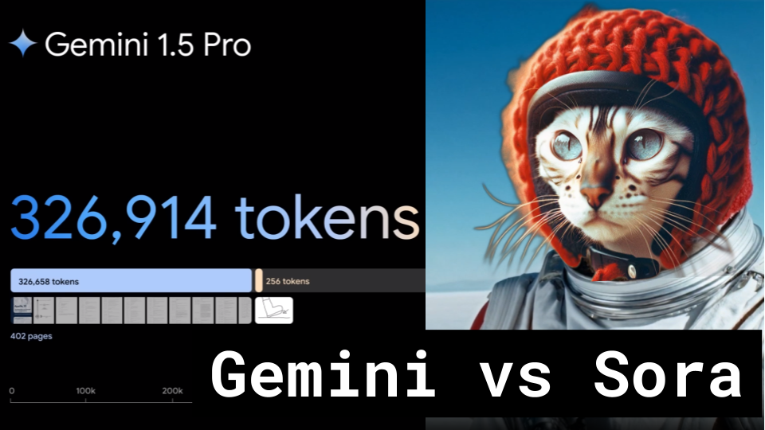

# Sora vs Gemini

### Links

**YouTube:** https://youtube.com/live/dPonS4kISPM

**X:** https://twitter.com/i/broadcasts/1mnxepkDjrqJX

**Twitch:**

**Substack:**

**ResearchHub:**

**YouTube:**

**TikTok:**

**Reddit:**

### References

- https://openai.com/research/video-generation-models-as-world-simulators
- https://arxiv.org/pdf/2402.08268.pdf
- https://x.com/gabor/status/1758282791547232482
- https://arxiv.org/pdf/2402.08609.pdf
- https://arxiv.org/pdf/2402.09727.pdf
- https://x.com/n_karaev/status/1758554094132662636?s=20
- https://storage.googleapis.com/deepmind-media/gemini/gemini_v1_5_report.pdf
- https://arxiv.org/pdf/2310.01889.pdf
- https://arxiv.org/pdf/2305.19370.pdf

- sora is japanese for sky?
- https://www.reddit.com/r/aivideo/s/Rxnjud9UwI
- https://x.com/sama/status/1758193609927721350
- https://x.com/ylecun/status/1758760027203006952

- https://twitter.com/_tim_brooks
- https://scholar.google.com/citations?user=sonlKXIAAAAJ

- https://twitter.com/billpeeb
- https://www.wpeebles.com/

- https://twitter.com/model_mechanic
- https://typeset.io/authors/aditya-ramesh-4xp87jcxw7
- https://arxiv.org/abs/2204.06125
- https://arxiv.org/abs/2102.12092

## Notes

notes

### Blog

notes

### Vertical Video

title
description
hashtags
