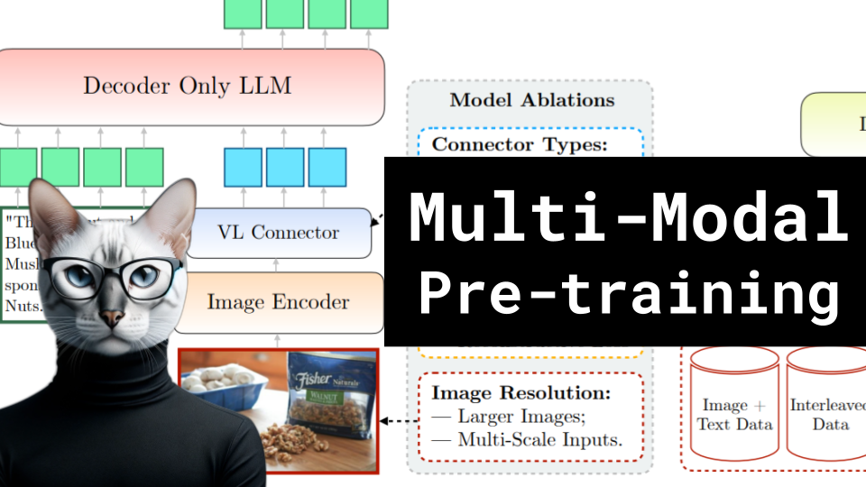

# Multi-Modal Pre-training (Apple's MM1)

### Links

**YouTube:** https://youtube.com/live/viiB3JmK21M

**X:** https://twitter.com/i/broadcasts/1dRKZEXgmLaxB

**Twitch:** 

**Substack:**

**ResearchHub:**

**TikTok:**

**Reddit:**

### References

MM1: Methods, Analysis & Insights from Multimodal LLM Pre-training
https://arxiv.org/pdf/2403.09611.pdf

Simple and Scalable Strategies to Continually Pre-train Large Language Models
https://arxiv.org/pdf/2403.08763.pdf

C-Abstractor
https://arxiv.org/abs/2312.06742

Mo patches mo tokens
https://i0.wp.com/syncedreview.com/wp-content/uploads/2022/12/image-54.png?resize=593%2C700&ssl=1

Pooling
https://www.researchgate.net/publication/333593451/figure/fig2/AS:765890261966848@1559613876098/Illustration-of-Max-Pooling-and-Average-Pooling-Figure-2-above-shows-an-example-of-max.png

DFN 5B
https://huggingface.co/apple/DFN5B-CLIP-ViT-H-14

## Notes

notes

### Blog

notes

### Vertical Video

title
description
hashtags
