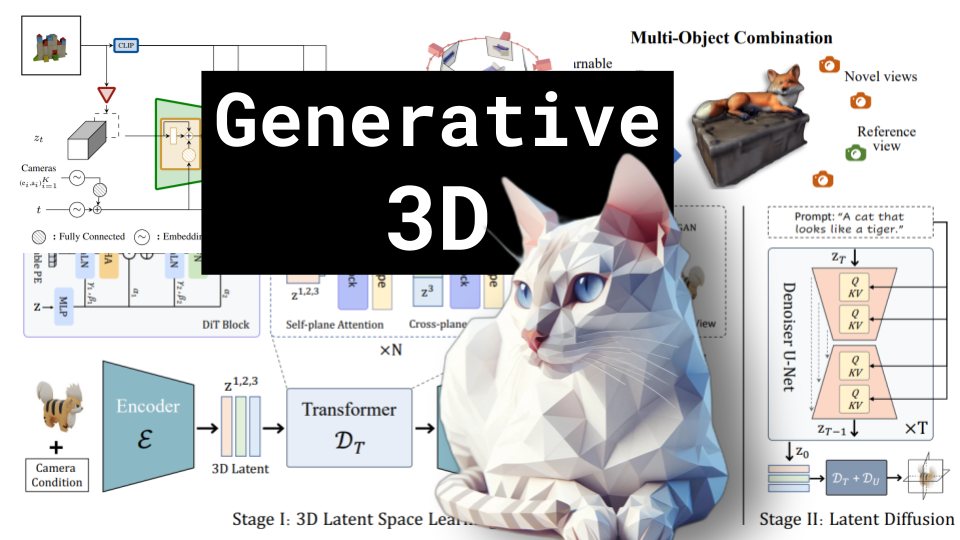

# Generative 3D

### Links

**YouTube:** https://youtube.com/live/IsRHGf2rGCs

**X:** https://twitter.com/i/broadcasts/1YpKkwdoMXYKj

**Twitch:**

**Substack:**

**ResearchHub:**

**TikTok:**

**Reddit:**

### References

VFusion3D: Learning Scalable 3D Generative Models from Video Diffusion Models
https://arxiv.org/pdf/2403.12034.pdf

SV3D
https://arxiv.org/pdf/2403.12008.pdf

GaussianFlow: Splatting Gaussian Dynamics for 4D Content Creation
https://arxiv.org/pdf/2403.12365.pdf

Generic 3D Diffusion Adapter Using Controlled Multi-View Editing
https://arxiv.org/pdf/2403.12032.pdf

Compress3D: a Compressed Latent Space for 3D Generation from a Single Image
https://arxiv.org/pdf/2403.13524.pdf

LN3Diff: Scalable Latent Neural Fields Diffusion for Speedy 3D Generation
https://arxiv.org/pdf/2403.12019.pdf

ComboVerse: Compositional 3D Assets Creation Using Spatially-Aware Diffusion Guidance
https://arxiv.org/pdf/2403.12409.pdf

## Notes

notes

### Blog

notes

### Vertical Video

title
description
hashtags
