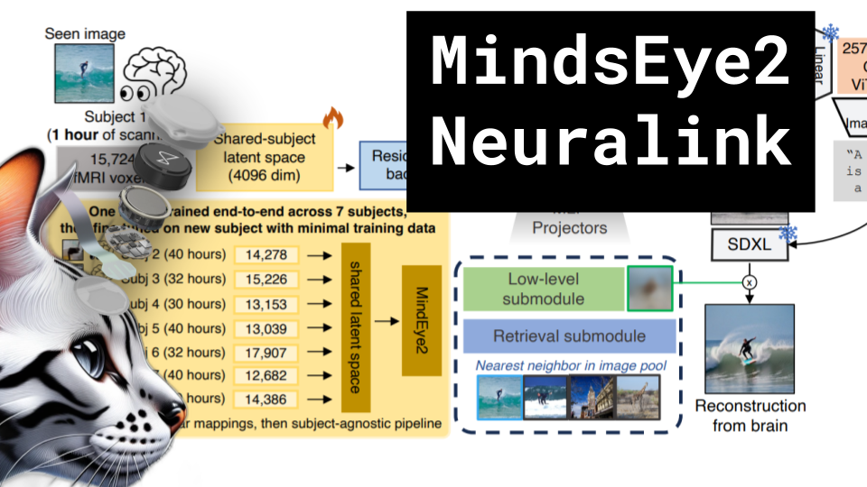

# MindsEye2 Neuralink

### Links

**YouTube:** https://youtube.com/live/e4SmDIH9908

**X:** https://twitter.com/i/broadcasts/1jMJgmYoeBeKL

**Twitch:**

**Substack:**

**ResearchHub:**

**TikTok:**

**Reddit:**

### References

MindEye2: Shared-Subject Models Enable fMRI-To-Image With 1 Hour of Data
https://arxiv.org/pdf/2403.11207.pdf

Neuralink
https://neuralink.com/blog/understanding-preclinical-research-at-neuralink/

https://www.brainfacts.org/3d-brain#intro=false&focus=Brain-cerebral_hemisphere-frontal_lobe-motor_cortex

https://afterimagia.pl/app/uploads/2020/09/022Korawzrokowaiinnestrukturykorowezaangazowanewwidzenie1_en-1024x883.jpg

https://github.com/mlfoundations/open_clip

## Notes

notes

### Blog

notes

### Vertical Video

title
description
hashtags
