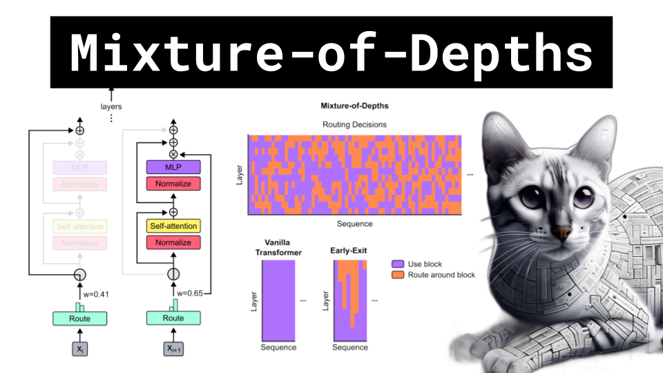

# Mixture-of-Depths

### Links

**YouTube:** https://youtube.com/live/Teru_qIdB8Y

**X:** https://twitter.com/i/broadcasts/1LyxBnEBkQkxN

**Twitch:**

**Substack:**

**ResearchHub:**

**TikTok:**

**Reddit:**

### References

Mixture-of-Depths: Dynamically allocating compute in transformer-based language models
https://arxiv.org/pdf/2404.02258.pdf

https://twitter.com/theseamouse/status/1775782800362242157?s=12&t=BSlMYtugAr8LLWXLnMLLrQ

LLM Visualization
https://bbycroft.net/llm

Deep Residual Learning for Image Recognition
https://arxiv.org/pdf/1512.03385.pdf

What skip connections look like in code
https://github.com/karpathy/minGPT/blob/37baab71b9abea1b76ab957409a1cc2fbfba8a26/mingpt/model.py#L90

Compute Graphs
https://www.researchgate.net/publication/340457442/figure/fig4/AS:877300765712391@1586176210735/Comparison-between-a-a-static-computation-graph-in-TensorFlow-115-and-b-an.png
https://huyenchip.com/assets/pics/compilers/13_graph_optimization.png
https://huyenchip.com/assets/pics/compilers/8_irs.png

Overfitting
https://cdn.analyticsvidhya.com/wp-content/uploads/2020/02/Screenshot-2020-02-06-at-11.09.13.png
