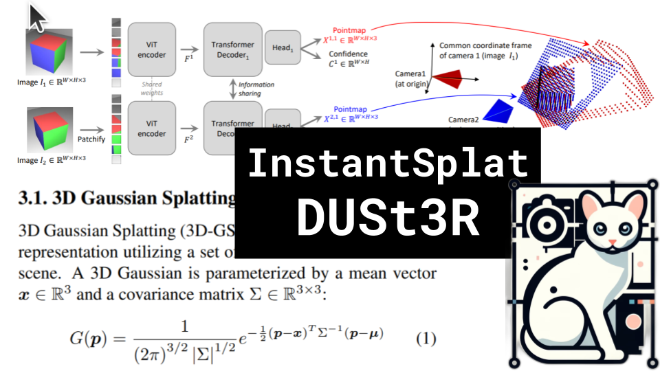

# InstantSplat, DUSt3R

### Links

**YouTube:** https://youtube.com/live/JdfrG89iPOA

**X:** https://twitter.com/i/broadcasts/1nAJEaeBnEyJL

**Twitch:**

**Substack:**

**ResearchHub:**

**TikTok:**

**Reddit:**

### References

InstantSplat: Unbounded Sparse-view Pose-free Gaussian Splatting in 40 Seconds
https://arxiv.org/pdf/2403.20309.pdf

DUSt3R: Geometric 3D Vision Made Easy
https://arxiv.org/pdf/2312.14132.pdf

RANSAC
https://github.com/sjkenny/ransac?tab=readme-ov-file#example-ring-fitting

Weiszfeld's algorithm
https://twitter.com/gabrielpeyre/status/1334739210255835136

Spherical Harmonics
https://www.researchgate.net/profile/Jacob-Hollebon-2/publication/345372557/figure/fig1/AS:954811419725829@1604656190963/Real-part-of-a-set-of-spherical-harmonics-mapped-to-the-surface-of-a-sphere-The-colour.ppm

COLMAP
https://colmap.github.io/tutorial.html#structure-from-motion
