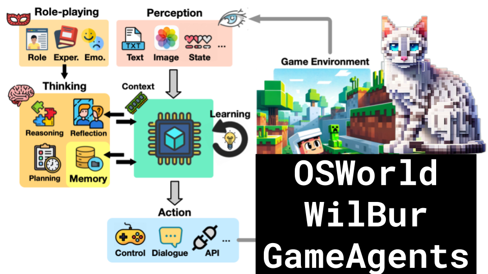

# OSWorld, Wilbur, Game Agents

### Links

**YouTube:** https://youtube.com/live/slthKMDR0uo

**X:** https://twitter.com/i/broadcasts/1rmxPMOevPLKN

**Twitch:**

**Substack:**

**ResearchHub:**

**TikTok:**

**Reddit:**

### References

A Survey on Large Language Model-Based Game Agents
https://arxiv.org/pdf/2404.02039.pdf

OSWORLD: Benchmarking Multimodal Agents for Open-Ended Tasks in Real Computer Environments
https://arxiv.org/pdf/2404.07972.pdf

WILBUR: Adaptive In-Context Learning for Robust and Accurate Web Agents
https://arxiv.org/pdf/2404.05902.pdf

ResearchAgent: Iterative Research Idea Generation over Scientific Literature with Large Language Models
https://arxiv.org/abs/2404.07738

Autonomous Evaluation and Refinement of Digital Agents
https://arxiv.org/abs/2404.06474

https://news.ycombinator.com/item?id=40008109

WE BAR E N A: A REALISTIC WEB ENVIRONMENT FOR BUILDING AUTONOMOUS AGENTS
https://arxiv.org/pdf/2307.13854.pdf

https://x.ai/blog/grok-1.5v

https://en.wikipedia.org/wiki/Markov_decision_process
