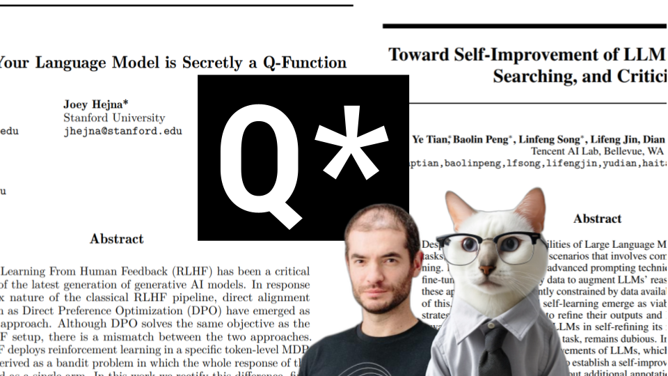

# Q*

### Links

**YouTube:** https://youtube.com/live/vOA9JSDPJs0

**X:** https://twitter.com/i/broadcasts/1djGXNdlrrOxZ

**Twitch:**

**Substack:**

**ResearchHub:**

**TikTok:**

**Reddit:**

### References

From r to Q∗: Your Language Model is Secretly a Q-Function
https://arxiv.org/pdf/2404.12358.pdf

Toward Self-Improvement of LLMs via Imagination, Searching, and Criticizing
https://arxiv.org/pdf/2404.12253.pdf

MCTS
https://towardsdatascience.com/monte-carlo-tree-search-158a917a8baa

Multi-Arm Bandit
https://medium.com/udemy-engineering/building-a-multi-armed-bandit-system-from-the-ground-up-a-recommendations-and-ranking-case-study-b598f1f880e1

Physical Intelligence
https://physicalintelligence.company/

Beam search
https://en.wikipedia.org/wiki/Beam_search

Let's Verify Step by Step
https://cdn.openai.com/improving-mathematical-reasoning-with-process-supervision/Lets_Verify_Step_by_Step.pdf

PAL: Program-aided Language Models
https://arxiv.org/pdf/2211.10435.pdf

Yann LeCunn Tweets and Cherry
https://twitter.com/ylecun/status/1728126868342145481?lang=en
https://i0.wp.com/syncedreview.com/wp-content/uploads/2019/02/2019-02-20-%E4%B8%8A%E5%8D%881.51.14.png
