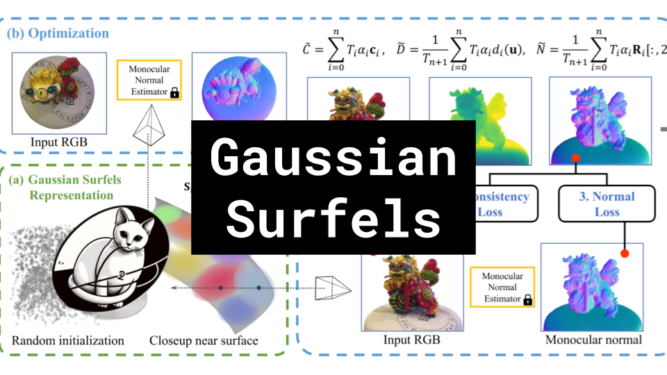

# Gaussian Surfels

### Links

**YouTube:** https://youtube.com/live/BRgm5vteAjQ

**X:** https://twitter.com/i/broadcasts/1YqKDgBvPzzxV

**Twitch:**

**Substack:**

**ResearchHub:**

**TikTok:**

**Reddit:**

### References

High-quality Surface Reconstruction using Gaussian Surfels
https://arxiv.org/abs/2404.17774

Chamfer Distance
https://www.researchgate.net/profile/Lei-Chu-8/publication/358143188/figure/fig3/AS:1116880265850895@1643296414912/The-weak-rotation-awareness-of-Chamfer-Distance-The-figure-demonstrates-Chamfer.ppm

Surfels
https://www.cs.umd.edu/~zwicker/publications/Surfels-SIG00.pdf

NeRF
https://theaisummer.com/static/c8a7474955d2af53d28319f09723506e/56caf/nerf-training.png

Mesh and Texture
https://www.mdpi.com/applsci/applsci-08-02228/article_deploy/html/images/applsci-08-02228-g001.png
https://i.stack.imgur.com/RT7OH.jpg

GPU Rasterization
http://15418.courses.cs.cmu.edu/spring2014/lecture/gpuarch/slide_018

Splat example
https://lumalabs.ai/capture/7f763b07-15bc-430e-84bf-9825f8e0c89e

Covariance Matrix
https://miro.medium.com/v2/resize:fit:1400/format:webp/1*Djn-aVWcH5Lu4i2-eLfn1g.png

SSIM
https://www.researchgate.net/profile/Hojatollah-Yeganeh-2/publication/283461887/figure/fig5/AS:670025388150786@1536757909078/Comparison-of-SSIM-and-MSE-performances-for-Einstein-image-altered-with-different.png
https://videoprocessing.ai/assets/img/metrics/psnr_and_ssim/pic19.png

Omnidata
https://omnidata.vision/

Screened Poisson Surface Reconstruction
https://www.cs.jhu.edu/~misha/MyPapers/ToG13.pdf

NeuS2
https://vcai.mpi-inf.mpg.de/projects/NeuS2/

Karpathy on CUDA/C++
https://twitter.com/karpathy/status/1786537319576789425
