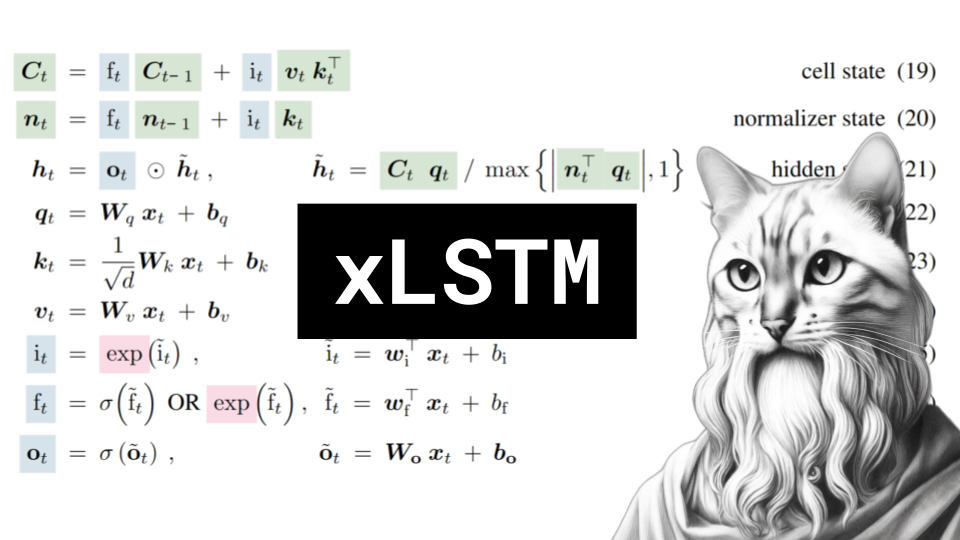

# xLSTM

### Links

**YouTube:** https://youtube.com/live/udIEwt0xM6A

**X:** https://twitter.com/i/broadcasts/1ZkKzjABZdeKv

**Twitch:**

**Substack:**

**ResearchHub:**

**TikTok:**

**Reddit:**

### References

xLSTM: Extended Long Short-Term Memory
https://arxiv.org/abs/2405.04517

LSTM
https://www.researchgate.net/publication/365066504/figure/fig3/AS:11431281094594268@1667511244779/The-structure-of-the-LSTM-network-cell-The-cell-consists-of-three-kinds-of-gates-units.ppm

another LSTM
https://www.researchgate.net/profile/Zhenyu-Chen-20/publication/332662013/figure/fig3/AS:751758288637957@1556244551951/RNN-and-LSTM-comparison-chart.jpg

ELU
https://paperswithcode.com/method/elu

Online normalizer calculation for softmax
https://arxiv.org/pdf/1805.02867
