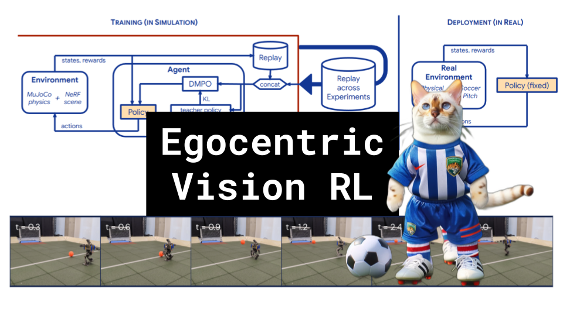

# Egocentric Vision RL

### Links

**YouTube:** https://youtube.com/live/40FL4peq60k

**X:** https://twitter.com/i/broadcasts/1jMKgmwzgjMJL

**Twitch:**

**Substack:**

**ResearchHub:**

**TikTok:**

**Reddit:**

### References

Learning Robot Soccer from Egocentric Vision with Deep Reinforcement Learning
https://arxiv.org/abs/2405.02425

REPLAY ACROSS EXPERIMENTS: A NATURAL EXTENSION OF OFF-POLICY RL
https://arxiv.org/pdf/2311.15951

distillation
https://editor.analyticsvidhya.com/uploads/30818Knowledge%20Distillation%20Flow%20Chart%201.2.jpg

KL divergence
https://twitter.com/ari_seff/status/1303741288911638530

LSTM unroll length
https://www.researchgate.net/profile/Zhenyu-Chen-20/publication/332662013/figure/fig3/AS:751758288637957@1556244551951/RNN-and-LSTM-comparison-chart.jpg
