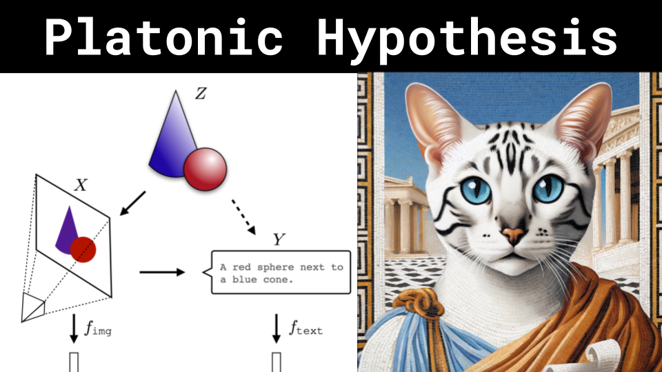

# Platonic Hypothesis

### Links

**YouTube:** https://youtube.com/live/Q9DCL_m_haw

**X:** https://twitter.com/i/broadcasts/1gqxvQEmNBBJB

**Twitch:**

**Substack:**

**ResearchHub:**

**TikTok:**

**Reddit:**

### References

The Platonic Representation Hypothesis
https://arxiv.org/pdf/2405.07987

Cave analogy
https://i.ytimg.com/vi/d71tYwcpHNM/hq720.jpg?sqp=-oaymwEhCK4FEIIDSFryq4qpAxMIARUAAAAAGAElAADIQj0AgKJD&rs=AOn4CLCsnh47zXySMQ2Jyw-1GM5vaUGrpw

Activation Atlas
https://distill.pub/2019/activation-atlas/

CNN
https://adamharley.com/nn_vis/cnn/3d.html

4D
https://math.ucr.edu/home/baez/mathematical/1000px-dimension_levels.jpg

Mutual Information
https://en.wikipedia.org/wiki/Mutual_information
