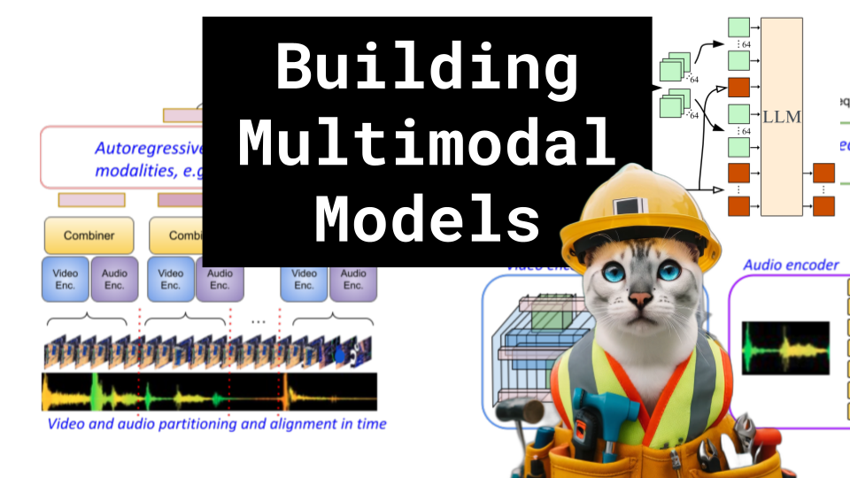

# Building Multimodal Models

### Links

**YouTube:** https://youtube.com/live/27cjzGgyxtw

**X:** https://twitter.com/i/broadcasts/1gqxvQEmNnwJB

**Twitch:**

**Substack:**

**ResearchHub:**

**TikTok:**

**Reddit:**

### References

What matters when building vision-language models?
https://arxiv.org/pdf/2405.02246

Mirasol3B: A Multimodal Autoregressive Model for Time-Aligned and Contextual Modalities
https://arxiv.org/pdf/2311.05698

Gemini 1.5: Unlocking multimodal understanding across millions of tokens of context
https://storage.googleapis.com/deepmind-media/gemini/gemini_v1_5_report.pdf

Scaling Autoregressive Multi-Modal Models: Pretraining and Instruction Tuning
https://arxiv.org/pdf/2309.02591

Chameleon: Mixed-Modal Early-Fusion Foundation Models
https://arxiv.org/pdf/2405.09818

Cross Attention
https://substackcdn.com/image/fetch/f_auto,q_auto:good,fl_progressive:steep/https%3A%2F%2Fsubstack-post-media.s3.amazonaws.com%2Fpublic%2Fimages%2F9057444e-4934-4253-bc91-9e768d23b0c2_846x972.png

Average Pooling
https://production-media.paperswithcode.com/methods/Screen_Shot_2020-05-24_at_1.51.40_PM.png

Spectogram
https://www.researchgate.net/profile/Sri-Harsha-Dumpala/publication/319081627/figure/fig1/AS:534034566004736@1504335170521/Spectrogram-of-a-speech-signal-with-breath-sound-marked-as-Breath-whose-bounds-are.png

Obelixs, Idefixs
https://media.mutualart.com/Images/2021_11/09/02/021007431/480c4477-8b86-4c0e-a618-9d3e61cb1751.Jpeg?w=480

GPT-4o Memory
https://x.com/gdb/status/1790071008499544518

LSTM
https://classic.d2l.ai/_images/lstm-2.svg
