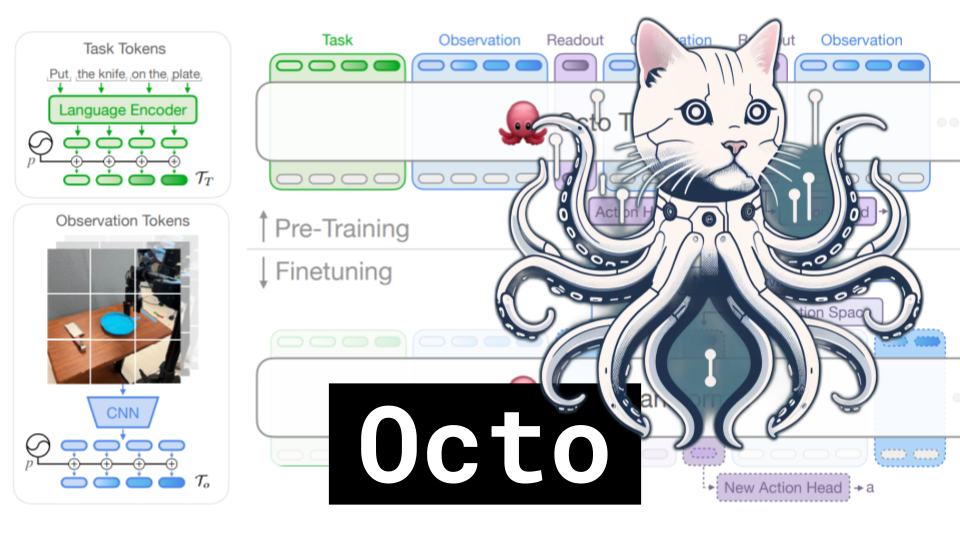

# Octo

### Links

**YouTube:** https://youtube.com/live/Rcm2-4Zm_yY

**X:** https://twitter.com/i/broadcasts/1jMJgmXrwjXKL

**Twitch:**

**Substack:**

**ResearchHub:**

**TikTok:**

**Reddit:**

### References

Octo: An Open-Source Generalist Robot Policy
https://arxiv.org/pdf/2405.12213

https://octo-models.github.io/

Expressive Whole-Body Control for Humanoid Robots
https://arxiv.org/abs/2402.16796

https://expressive-humanoid.github.io/

attention registers
https://arxiv.org/pdf/2309.16588
