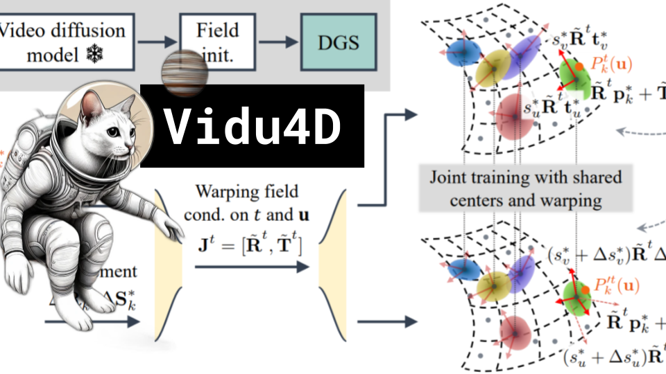

# Vidu4D

### Links

**YouTube:** https://youtube.com/live/4tUkDj3pglg

**X:** https://twitter.com/i/broadcasts/1YqKDgejQyBxV

**Twitch:**

**Substack:**

**ResearchHub:**

**TikTok:**

**Reddit:**

### References

Vidu4D: Single Generated Video to High-Fidelity 4D Reconstruction with Dynamic Gaussian Surfels
https://arxiv.org/pdf/2405.16822

https://vidu4d-dgs.github.io/

Spartan Lambda
https://qph.cf2.quoracdn.net/main-qimg-1bec67c2f15ca3eefb6ebf68326dc8f0-lq

Mahalonobis Distance
https://miro.medium.com/v2/resize:fit:1400/1*KzsugPQU-BTjvDACXbu9qw.jpeg

Dual Quaternion Skinning
https://binh.graphics/papers/2016s-cor/CoR-RepImg.jpg

Cycle Consistency Loss
https://paperswithcode.com/method/cycle-consistency-loss

Surfels
https://www.cs.umd.edu/~zwicker/publications/Surfels-SIG00.pdf

NeRF
https://theaisummer.com/static/c8a7474955d2af53d28319f09723506e/56caf/nerf-training.png

Mesh and Texture
https://www.mdpi.com/applsci/applsci-08-02228/article_deploy/html/images/applsci-08-02228-g001.png https://i.stack.imgur.com/RT7OH.jpg

GPU Rasterization
http://15418.courses.cs.cmu.edu/spring2014/lecture/gpuarch/slide_018

Splat example
https://lumalabs.ai/capture/7f763b07-15bc-430e-84bf-9825f8e0c89e
