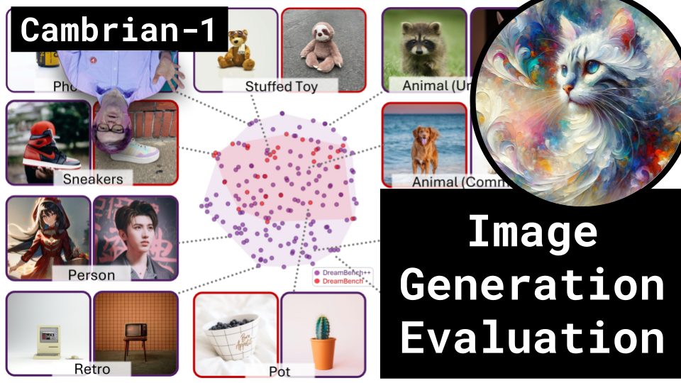

# Image Generation Evaluation + Cambrian-1

### Links

**YouTube:** https://youtube.com/live/GyB4FKLAN6g

**X:** https://twitter.com/i/broadcasts/1DXGyjqwEkLJM

**Twitch:**

**Substack:**

**ResearchHub:**

**TikTok:**

**Reddit:**

### References

DREAMBENCH++: A Human-Aligned Benchmark for Personalized Image Generation
https://arxiv.org/pdf/2406.16855

Rich Human Feedback for Text-to-Image Generation
https://arxiv.org/pdf/2312.10240

Cambrian-1: A Fully Open, Vision-Centric Exploration of Multimodal LLMs
https://arxiv.org/pdf/2406.16860