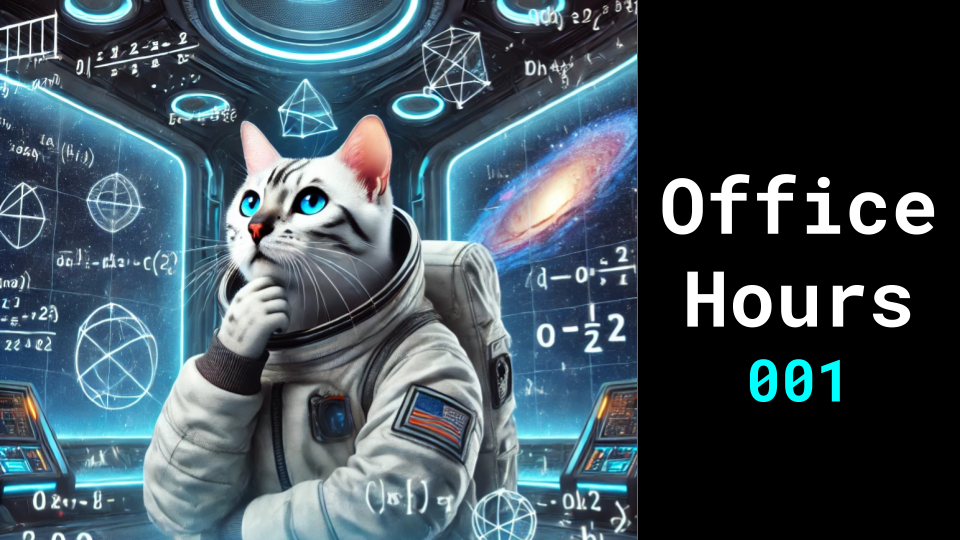

# Office Hours 001

### Links

**YouTube:** https://youtube.com/live/I2UO9O0ImFc

**X:** https://twitter.com/i/broadcasts/1gqGvNkDDMwGB

**Twitch:**

**Substack:**

**ResearchHub:**

**TikTok:**

**Reddit:**

### References

Learning to (Learn at Test Time): RNNs with Expressive Hidden States
https://arxiv.org/pdf/2407.04620

https://github.com/sebastianstarke/AI4Animation/blob/master/Media/SIGGRAPH_2024/Paper.pdf

Compress then Serve: Serving Thousands of LoRA
Adapters with Little Overhead
https://www.arxiv.org/pdf/2407.00066

Scaling Synthetic Data Creation with 1,000,000,000 Personas
https://arxiv.org/pdf/2406.20094

LivePortrait: Efficient Portrait Animation with Stitching and Retargeting Control
https://arxiv.org/pdf/2407.03168v1

µ-BENCH: VISION-LANGUAGE BENCHMARK FOR MICROSCOPY
UNDERSTANDING
https://arxiv.org/pdf/2407.01791

PaliGemma: A versatile 3B VLM for transfer
https://arxiv.org/pdf/2407.07726
