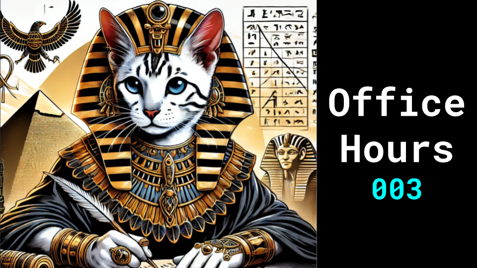

# Office Hours 003

### Links

**YouTube:** https://youtube.com/live/mWeOGzDTvXM

**X:** https://twitter.com/i/broadcasts/1ynKODEmmPnGR

**Twitch:**

**Substack:**

**ResearchHub:**

**TikTok:**

**Reddit:**

### References

cat trailer, cat rave, cat rap song

use moebius as the style, pick some of his pictures
make it a music video so you just have to pick one song
cat western in a desert
city cyberpunk
spaceshiop

The image portrays a highly stylized, retro-futuristic science fiction scene, reminiscent of classic comic book art. It features a detailed, hand-drawn quality with an alien landscape dominated by a large spacecraft and floating structures, evoking a sense of wonder and mystery. The presence of a lone figure walking towards the towering structures adds a feeling of solitude and exploration. The overall vibe is nostalgic and dreamlike, blending a vision of the future from the past with a surreal, expansive landscape.

artistic and illustrative style with the first, characterized by a detailed, hand-drawn quality and a retro-futuristic aesthetic. Both images have vibrant, surreal elements that evoke a sense of wonder and otherworldliness. In this image, a figure interacts with a large, intricate mural of a face surrounded by colorful, abstract patterns, suggesting a blend of science fiction and fantasy. The scene is filled with scattered objects and tools, adding to the sense of an ongoing creative or exploratory process. The commonalities between the two images include the retro-futuristic design, the solitary figure in a mysterious setting, and the use of vibrant, dreamlike colors to create a sense of nostalgia and wonder.

This image exemplifies retro-futuristic science fiction art, blending nostalgia with imaginative visions of the future. The detailed illustration uses a striking contrast of warm oranges and cool blues to create a surreal, alien landscape. It evokes a mood of solitary exploration and wonder, with a lone figure dwarfed by massive spacecraft and distant structures. The style recalls classic sci-fi book covers, capturing a sense of adventure and technological advancement while also conveying a touch of isolation. Overall, the piece balances optimism about human potential with the awe-inspiring, slightly unsettling nature of encountering the unknown, embodying the essence of golden age science fiction visuals.

This image shares key stylistic elements with the first, including intricate detailing, vibrant colors, and a surreal atmosphere that blends reality with fantasy. Both feature a contrast of scale and fuse organic and inorganic elements, rewarding close inspection with numerous background details. While the first image was distinctly retro-futuristic sci-fi, this one leans more into a psychedelic, possibly cyberpunk aesthetic, using a broader color palette dominated by purples, blues, and yellows. It maintains the exploratory theme and imaginative spirit of the first image, but diverges into a more fantastical, mind-bending style reminiscent of psychedelic art and certain anime influences. Both illustrations exemplify highly creative, speculative visual art, each exploring different facets of surreal, otherworldly scenes.

LLAMA3.1

highly stylized, retro-futuristic science fiction scene with a detailed, hand-drawn quality, reminiscent of classic comic book art and golden age science fiction visuals. The image should evoke a sense of wonder, mystery, and solitary exploration, with a lone figure interacting with a surreal, alien landscape dominated by massive structures, spacecraft, or futuristic architecture. Incorporate vibrant, dreamlike colors and intricate detailing, blending nostalgia with imaginative visions of the future. The style should balance optimism and awe with a touch of isolation and the unknown, and may incorporate elements of fantasy, psychedelia, and cyberpunk aesthetics. The overall vibe should be nostalgic, yet futuristic, with a sense of adventure and technological advancement

GPT

highly stylized, retro-futuristic science fiction scene with a detailed, hand-drawn quality reminiscent of classic comic book art. It features a surreal, expansive alien landscape dominated by large spacecraft, floating structures, and vibrant, dreamlike colors. A lone figure walking towards the towering structures evokes a sense of solitude, exploration, and nostalgia. The scene blends imaginative visions of the future from the past, using a striking contrast of warm oranges and cool blues to create a mood of solitary wonder. The intricate detailing and scattered objects add to the sense of an ongoing creative or exploratory process, fusing organic and inorganic elements in a vibrant, otherworldly setting.

CLAUDE

highly detailed, hand-drawn illustration in a retro-futuristic style that blends classic sci-fi with psychedelic elements. The scene should feature a surreal, alien landscape with contrasting scales - massive structures or spacecraft alongside a solitary figure. Use a vibrant color palette that spans warm oranges, cool blues, and vivid purples and yellows to create a dreamlike atmosphere. Incorporate both organic and inorganic forms, fusing reality with fantasy. The image should evoke a sense of wonder, exploration, and slight unease, reminiscent of golden age science fiction book covers but with a modern, mind-bending twist. Include intricate background details that reward close inspection, balancing nostalgic retro-futurism with contemporary speculative art influences.

AUDIO: A opening theme with a haunting, otherworldly melody that captures the essence of the desert planet where a story unfolds. Features a combination of eerie, wavering woodwind instruments accompanied by a subtle, pulsing electronic undercurrent

LLAMA3 SCRIPT

Opening Scene
IMAGE: Generate an image for me of a anthropomorphic llama dressed in a flowing white robe, with an otherworldly aura about him on a desolate sandy planet.
SCRIPT: In a distant corner of the galaxy...

Second Scene
IMAGE: Generate a portrait shot of a anthropomorphic llama. His eyes gleam with an inner light.
SCRIPT:

3rd Scene
IMAGE: A group of anthropomorphic llamas, dressed in ornate, ceremonial robes, gathered around a holographic display projecting an image of a anthropomorphic llama.
SCRIPT: A legend returns.

4th Scene
IMAGE: Generate a image of a giant dark, ominous computer. A dark hooded llama hologram on the screen. 
SCRIPT: The open source prince is a threat to our power. We will not let him claim the throne.

5th Scene
IMAGE: Generate an image of a anthropomorphic llama standing triumphantly infront a crowd of zealous supporters.
SCRIPT: Join the epic struggle for control of our ai future.

