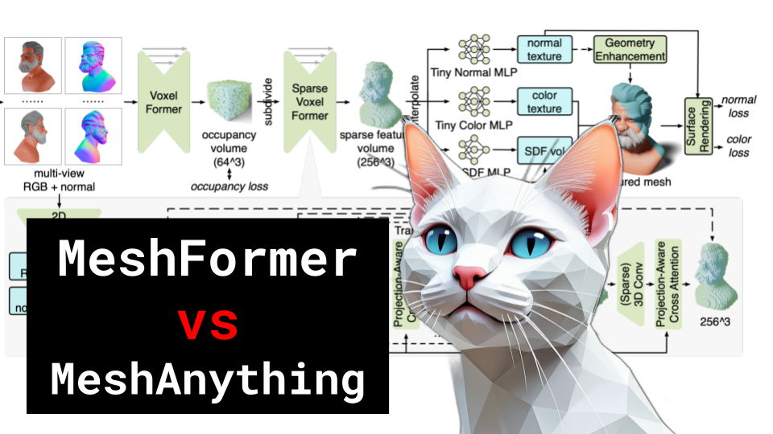

# MeshFormer vs MeshAnything

### Links

**YouTube:** https://youtube.com/live/SkvyrgSzigo

**X:** https://twitter.com/i/broadcasts/1zqKVYgrwoLxB

**Twitch:**

**Substack:**

**ResearchHub:**

**TikTok:**

**Reddit:**

### References

MeshFormer: High-Quality Mesh Generation with 3D-Guided Reconstruction Model
https://arxiv.org/pdf/2408.10198

MeshAnything: Artist-Created Mesh Generation with Autoregressive Transformers
https://arxiv.org/pdf/2406.10163

JPEG-LM: LLMs as Image Generators with Canonical Codec Representations
https://arxiv.org/abs/2408.08459

vqvae
https://paperswithcode.com/method/vq-vae

vit patches
https://lilianweng.github.io/posts/2022-06-09-vlm/VC-GPT.png

depth anything
https://depth-anything.github.io/

JPEG compression
https://parametric.press/issue-01/unraveling-the-jpeg/

marching cubes
https://www.cs.carleton.edu/cs_comps/0405/shape/marching_cubes.html

MJPEG and H.264
https://www.technexion.com/resources/h-264-vs-mjpeg-in-embedded-vision-all-you-need-to-know/
