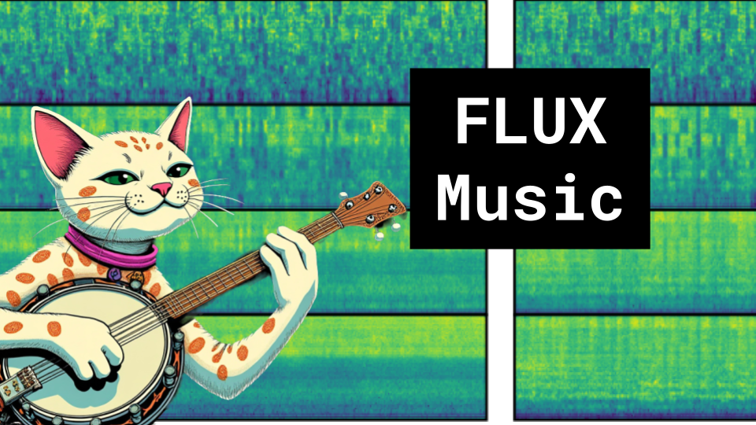

# FLUX Music

### Links

**YouTube:** https://youtube.com/live/U03zTGJdqdk

**X:** https://twitter.com/i/broadcasts/1mnGeAPMYaoGX

**Twitch:**

**Substack:**

**ResearchHub:**

**TikTok:**

**Reddit:**

### References

FLUX that Plays Music
https://arxiv.org/pdf/2409.00587

https://github.com/feizc/FluxMusic

https://github.com/black-forest-labs/flux
https://github.com/haoheliu/AudioLDM2

LOOPY: TAMING AUDIO-DRIVEN PORTRAIT AVATAR
WITH LONG-TERM MOTION DEPENDENCY
https://arxiv.org/pdf/2409.02634

WAVTOKENIZER: AN EFFICIENT ACOUSTIC DISCRETE
CODEC TOKENIZER FOR AUDIO LANGUAGE MODELING
https://arxiv.org/pdf/2408.16532v1
https://huggingface.co/papers/2408.16532

Rectified Flow
https://www.cs.utexas.edu/~lqiang/rectflow/html/intro.html

Mel Spectogram
https://medium.com/analytics-vidhya/understanding-the-mel-spectrogram-fca2afa2ce53

Fourier
https://upload.wikimedia.org/wikipedia/commons/1/1a/Fourier_series_square_wave_circles_animation.gif

RVQ
https://drscotthawley.github.io/blog/posts/2023-06-12-RVQ.html

Black Forest Labs
https://blackforestlabs.ai/announcements/

Wav2Vec
https://huggingface.co/facebook/wav2vec2-base-960h
https://ai.meta.com/blog/wav2vec-20-learning-the-structure-of-speech-from-raw-audio/

