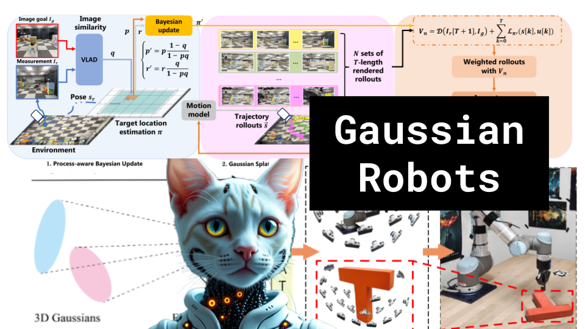

# Gaussian Robots

### Links

**YouTube:** https://youtube.com/live/_jqhy-dr7Q4

**X:** https://twitter.com/i/broadcasts/1ZkKzRvoLZrKv

**Twitch:**

**Substack:**

**ResearchHub:**

**TikTok:**

**Reddit:**

### References

Robust Dual Gaussian Splatting for Immersive Human-centric Volumetric Videos
https://arxiv.org/pdf/2409.08353

SplatSim: Zero-Shot Sim2Real Transfer of RGB Manipulation Policies Using Gaussian Splatting
https://arxiv.org/pdf/2409.10161

AdR-Gaussian: Accelerating Gaussian Splatting with Adaptive Radius
https://arxiv.org/pdf/2409.08669

SwinGS: Sliding Window Gaussian Splatting for Volumetric Video Streaming with Arbitrary Length
https://arxiv.org/pdf/2409.07759

Gaussian Garments: Reconstructing Simulation-Ready Clothing with Photorealistic Appearance from Multi-View Video
https://arxiv.org/pdf/2409.08189

Self-Evolving Depth-Supervised 3D Gaussian Splatting from Rendered Stereo Pairs
https://arxiv.org/pdf/2409.07456

Instant Facial Gaussians Translator for Relightable and Interactable Facial Rendering
https://arxiv.org/pdf/2409.07441

Fisheye-GS: Lightweight and Extensible Gaussian Splatting Module for Fisheye Cameras
https://arxiv.org/pdf/2409.04751

Dynamic Gaussian Marbles for Novel View Synthesis of Casual Monocular Videos
https://arxiv.org/pdf/2406.18717

BEINGS: Bayesian Embodied Image-goal Navigation with Gaussian Splatting
https://arxiv.org/pdf/2409.10216

gsplat
https://github.com/nerfstudio-project/gsplat

3D Gaussian Splatting as Markov Chain Monte Carlo
https://arxiv.org/abs/2404.09591
