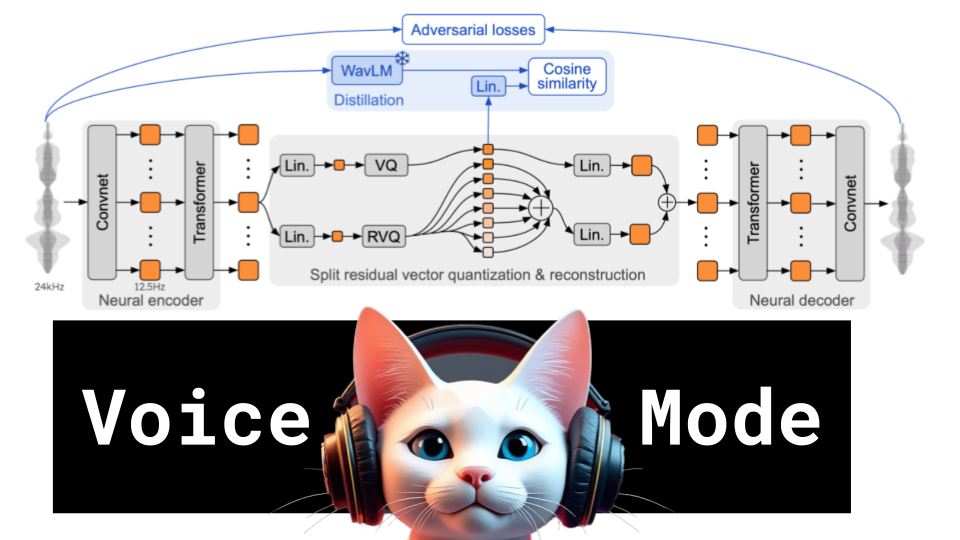

# Voice Mode

### Links

**YouTube:** https://youtube.com/live/x3fX7v7xjUA

**X:** https://twitter.com/i/broadcasts/1ynJODzrQqVxR

**Twitch:**

**Substack:**

**ResearchHub:**

**TikTok:**

**Reddit:**

### References

Moshi: a speech-text foundation model for real-time dialogue
https://kyutai.org/Moshi.pdf

LLaMA-Omni: Seamless Speech Interaction with Large Language Models
https://web3.arxiv.org/abs/2409.06666

torch.cuda.Event
https://pytorch.org/docs/stable/generated/torch.cuda.Event.html
https://github.com/kyutai-labs/moshi/blob/main/scripts/moshi_benchmark.py

moshi chat
https://moshi.chat/

voice mode system prompt
