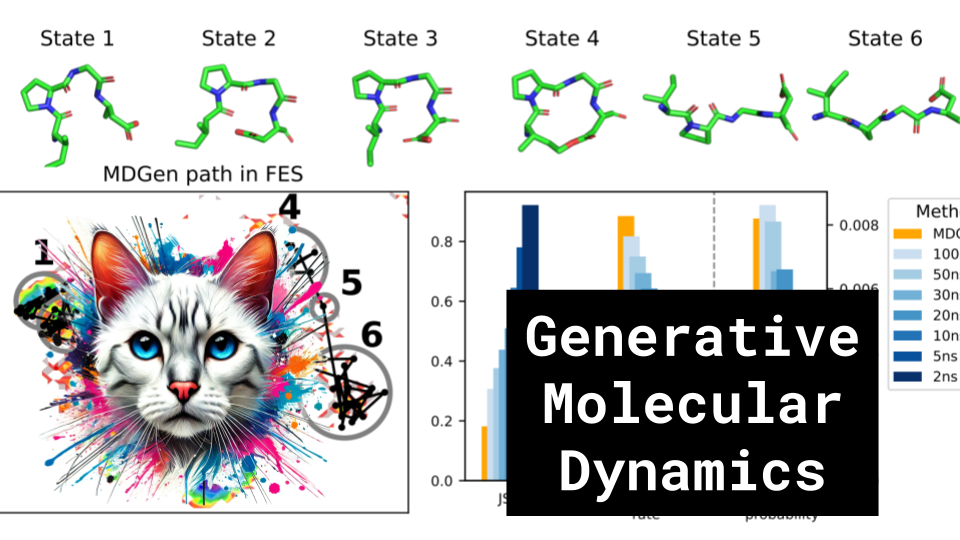

# Generative Molecular Dynamics

### Links

**YouTube:** https://youtube.com/live/tvpEewf978k

**X:** https://twitter.com/i/broadcasts/1PlJQbezDjYxE

**Twitch:**

**Substack:**

**ResearchHub:**

**TikTok:**

**Reddit:**

### References

Generative Modeling of Molecular Dynamics Trajectories
https://arxiv.org/html/2409.17808v1

https://openreview.net/forum?id=LbwM4VCDUU

https://arxiv.org/html/2409.17808v1

Molecular dynamics gifs
https://static.wixstatic.com/media/965d62_d33342f5e56c446684070f46a65339d6~mv2.gif
https://www.ljll.fr/gallery/html/BenjaminStamm-Ubiquitin.gif
https://molstar.org/viewer/?snapshot-url=https%3A%2F%2Fmolstar.org%2Fdemos%2Fstates%2Fmotor-hook.molx&snapshot-url-type=molx

Quantum Tunneling
https://miro.medium.com/v2/resize:fit:596/1*5R67Z5CYwwmrujPn21DTbA.png

Quantum effects in photosynthesis
https://russgeorge.net/2014/06/17/phytoplankton-use-quantum-coherence-survive-low-light/

Quantum effects in Consciousness
https://en.wikipedia.org/wiki/Orchestrated_objective_reduction

Lie Groups, SE(3)
https://en.wikipedia.org/wiki/Lie_group
https://en.wikipedia.org/wiki/Euclidean_group

AlphaFold Meets Flow Matching for Generating Protein Ensembles
https://www.mlsb.io/papers_2023/AlphaFold_Meets_Flow_Matching_for_Generating_Protein_Ensembles.pdf

Hyena Hierarchy: Towards Larger Convolutional Language Models
https://arxiv.org/pdf/2302.10866
