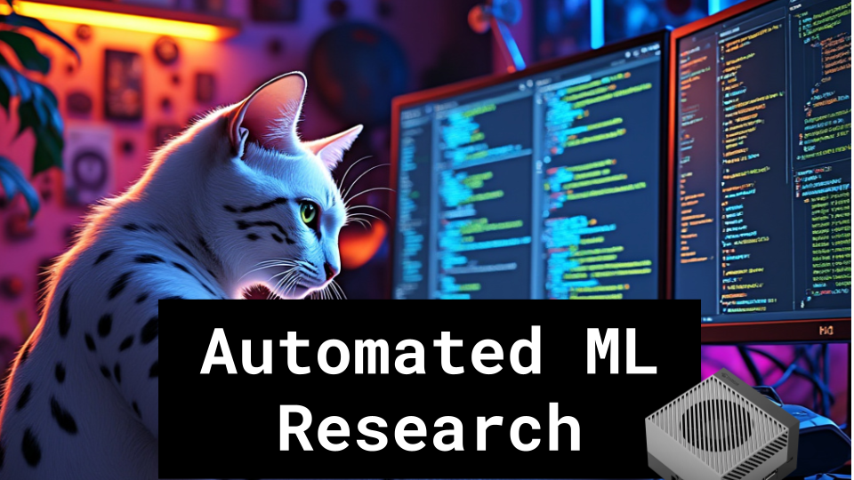

# Automated ML Research

### Links

**YouTube:** https://youtube.com/live/9J1Ofd1gYIk?feature=share

**X:** https://twitter.com/i/broadcasts/1nAJEpMQgYYGL

**Twitch:**

**Substack:**

**ResearchHub:**

**TikTok:**

**Reddit:**

### References

https://github.com/hu-po/evoarc

CAX: Cellular Automata Accelerated in JAX
https://arxiv.org/pdf/2410.02651.pdf

Tackling the Abstraction and Reasoning Corpus with Vision Transformers: the Importance of 2D Representation, Positions, and Objects
https://arxiv.org/abs/2410.06405

stream todos:
- run cnn on lambda labs instance (maybe ssh into it beforehand to prevent keys on stream)
- get o1 to create an RNN implementation
- iterate on mutation prompts
- read through technical guide and papers
- add claude api as agent
- use voice mode with tripod as stream buddy
- custom batch sizes and aug multipliers by machine

https://x.com/Hesamation/status/1846924454309323257

https://arxiv.org/abs/1803.03635

https://x.com/rohanpaul_ai/status/1846242281973486063

fuzzy search over not fuzzy programs 
https://x.com/fchollet/status/1846269999960543652

agent guided diffusion in code space

