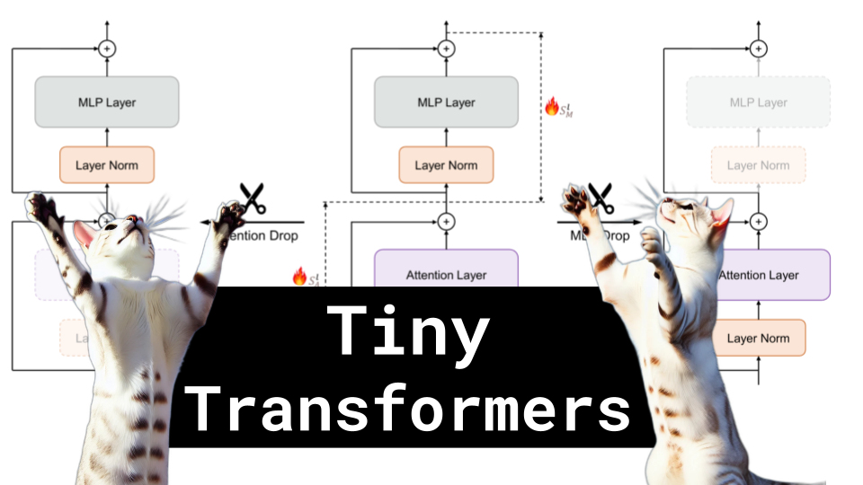

# Tiny Transformers

### Links

**YouTube:** https://youtube.com/live/HcE3I_iCvoI

**X:** https://twitter.com/i/broadcasts/1RDxlyRQRjDKL

**Twitch:**

**Substack:**

**ResearchHub:**

**TikTok:**

**Reddit:**

### References

references

What Matters In Transformers?
https://arxiv.org/pdf/2406.15786

1-bit AI Infra
https://arxiv.org/pdf/2410.16144

PYRAMIDDROP: ACCELERATING YOUR LARGE
VISION-LANGUAGE MODELS VIA PYRAMID VISUAL
REDUNDANCY REDUCTION
https://arxiv.org/pdf/2410.17247

https://transformer-circuits.pub/2021/framework/index.html#analyzing-a-two-layer-model

https://en.wikipedia.org/wiki/Lookup_table#Lookup_tables_in_image_processing

https://www.mobilephonemuseum.com/phone-detail/nokia-3310

https://en.wikipedia.org/wiki/GeForce_30_series
