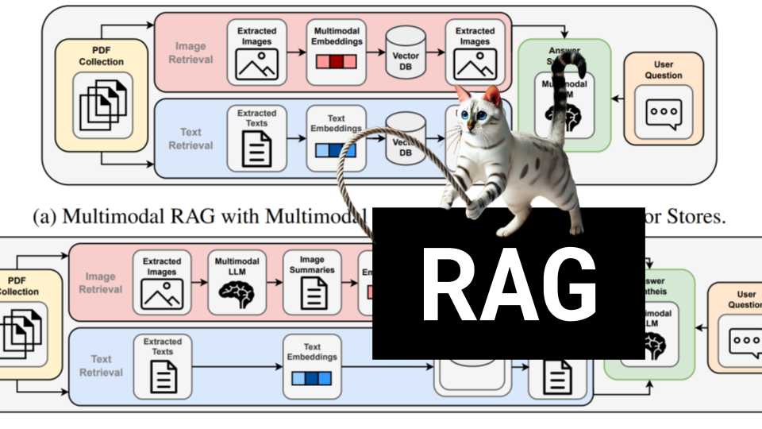

# RAG

### Links

**YouTube:** https://youtube.com/live/YLdK-683lCY

**X:** https://twitter.com/i/broadcasts/1lDxLljzeZqxm

**Twitch:**

**Substack:**

**ResearchHub:**

**TikTok:**

**Reddit:**

### References

Beyond Text: Optimizing RAG with Multimodal Inputs for Industrial Applications
https://arxiv.org/pdf/2410.21943

CORAL: Benchmarking Multi-turn Conversational Retrieval-Augmentation Generation
https://arxiv.org/pdf/2410.23090

AutoMIR: Effective Zero-Shot Medical Information Retrieval without Relevance Labels
https://arxiv.org/pdf/2410.20050

RARE: RETRIEVAL AUGMENTED RETRIEVAL WITH IN-CONTEXT EXAMPLES
https://arxiv.org/pdf/2410.20088

Zero-Shot Dense Retrieval with Embeddings from Relevance Feedback
https://arxiv.org/pdf/2410.21242

Vision Search Assistant: Empower Vision-Language Models as Multimodal Search Engines
https://arxiv.org/pdf/2410.21220

https://en.wikipedia.org/wiki/Turing_machine#Physical_description

https://en.wikipedia.org/wiki/Von_Neumann_architecture#stored-program-computer

https://ars.els-cdn.com/content/image/3-s2.0-B9780444826183500887-f40-03-9780444826183.jpg
