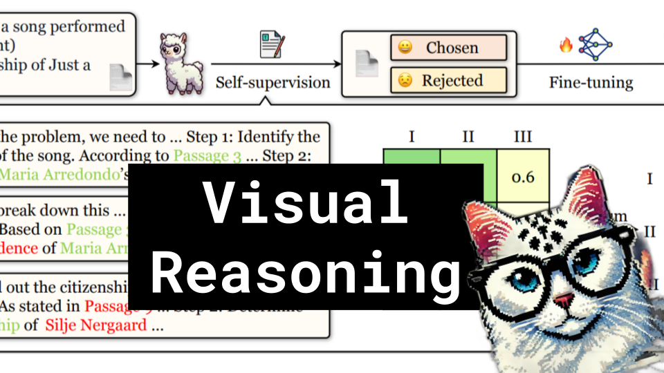

# Visual Reasoning

### Links

**YouTube:**

**X:**

**Twitch:**

**Substack:**

**ResearchHub:**

**TikTok:**

**Reddit:**

### References

https://illuminate.google.com/library?play=P6lrND1_WjBU

LLaVA-o1: Let Vision Language Models Reason Step-by-Step
https://arxiv.org/pdf/2411.10440

Large Language Models Can Self-Improve in Long-context Reasoning
- https://arxiv.org/pdf/2411.08147
- https://illuminate.google.com/library?play=OT6klt_BObf5

INFERENCE OPTIMAL VLMS NEED ONLY ONE VISUAL TOKEN BUT LARGER MODELS
https://arxiv.org/pdf/2411.03312v1

BlueLM-V-3B: Algorithm and System Co-Design for Multimodal Large Language Models on Mobile Devices
https://arxiv.org/pdf/2411.10640

GENERATIVE WORLD EXPLORER
https://arxiv.org/pdf/2411.11844

The Dawn of GUI Agent: A Preliminary Case Study with Claude 3.5 Computer Use
https://arxiv.org/pdf/2411.10323

https://illuminate.google.com/library?play=0CA0xg_SoEhm

DeepSeek-R1-Lite-Preview
https://x.com/deepseek_ai/status/1859200141355536422
