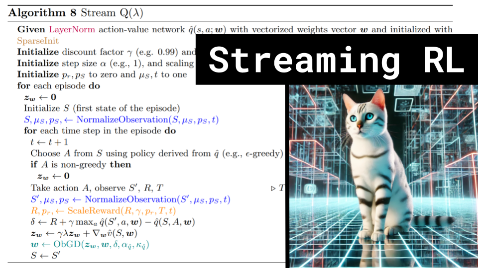

# Streaming RL

### Links

**YouTube:** https://youtube.com/live/5NFAzluHkcY

**X:** https://twitter.com/i/broadcasts/1lDxLlMAkEaxm

**Twitch:**

**Substack:**

**ResearchHub:**

**TikTok:**

**Reddit:**

### References

Streaming Deep Reinforcement Learning Finally Works
- https://arxiv.org/pdf/2410.14606
- https://github.com/mohmdelsayed/streaming-drl
- https://illuminate.google.com/library?play=kkZIWP_XBqe2

Hymba Hybrid-Head Architecture Boosts Small Language Model Performance
https://developer.nvidia.com/blog/hymba-hybrid-head-architecture-boosts-small-language-model-performance/

Optimizer Visualizations
https://github.com/j-w-yun/optimizer-visualization

Alberta Canada
https://c8.alamy.com/comp/2N04WRB/canada-administrative-divisions-political-map-the-ten-provinces-and-three-territories-of-canada-with-their-borders-and-capitals-2N04WRB.jpg

Bitter Lesson
http://www.incompleteideas.net/IncIdeas/BitterLesson.html

Atari
https://www.marktechpost.com/wp-content/uploads/2021/02/image4.gif

DM Control
https://www.marktechpost.com/wp-content/uploads/2021/02/image4.gif
