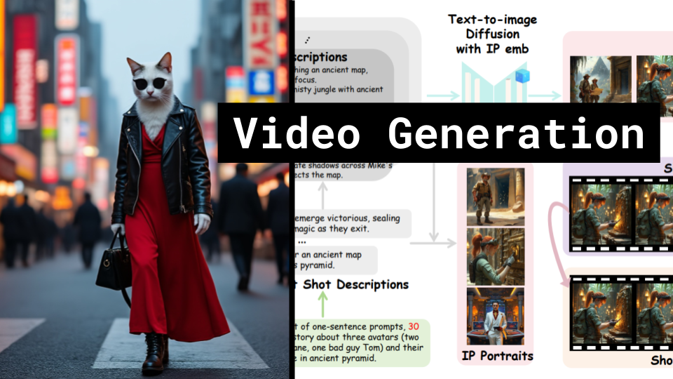

# Video Generation

### Links

**YouTube:** https://youtube.com/live/kfxy-ykLnZI

**X:** https://twitter.com/i/broadcasts/1ypKdpvQLzgKW

**Twitch:**

**Substack:**

**ResearchHub:**

**TikTok:**

**Reddit:**

### References

Open-Sora Plan: Open-Source Large Video Generation Model
https://arxiv.org/pdf/2412.00131

VideoGen-of-Thought: A Collaborative Framework for Multi-Shot Video Generation
https://arxiv.org/pdf/2412.02259

HunyuanVideo: A Systematic Framework For Large Video Generation Model Training
https://github.com/Tencent/HunyuanVideo/blob/main/assets/hunyuanvideo.pdf

X-Prompt: Towards Universal In-Context Image Generation in Auto-Regressive Vision Language Foundation Models
https://arxiv.org/pdf/2412.01824
