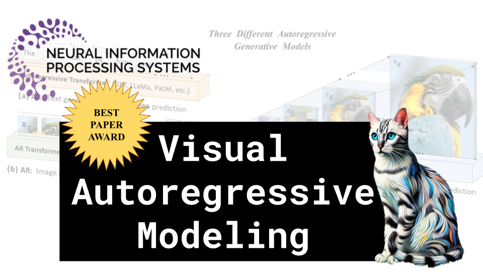

# Visual Autoregressive Modeling

### Links

**YouTube:** https://youtube.com/live/-jG7S5g071Q

**X:** https://twitter.com/i/broadcasts/1jMKgBwBDVlxL

**Twitch:**

**Substack:**

**ResearchHub:**

**TikTok:**

**Reddit:**

### References

Visual Autoregressive Modeling: Scalable Image Generation via Next-Scale Prediction
https://arxiv.org/pdf/2404.02905

Frechet Inception Distance
https://miro.medium.com/v2/resize:fit:2000/format:webp/1*K3_pVEEvtSgYRR9zUokDBA.png

VQ-VAE
https://raw.githubusercontent.com/lucidrains/vector-quantize-pytorch/master/images/vq.png

convnet
https://8f430952.rocketcdn.me/wp-content/uploads/2018/01/conv-full-layer.gif

raster scan
https://miro.medium.com/v2/resize:fit:1400/1*uJObiQZsEMclcmoS4gv7zw.png

Tian Lawsuit
https://www.shine.cn/news/nation/2412047516/
