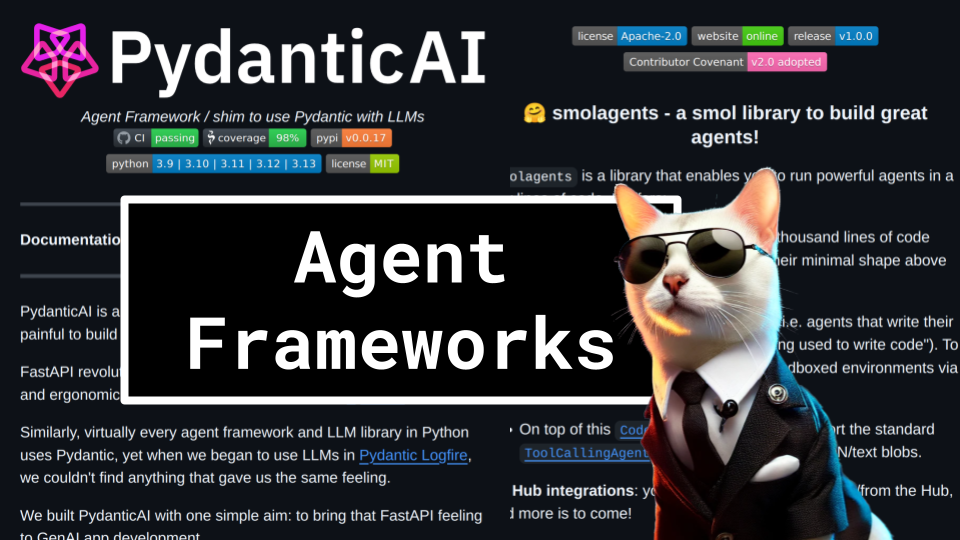

# Predictions 2025

### Links

**YouTube:** https://youtube.com/live/HVyq0n8qSnE

**X:** https://twitter.com/i/broadcasts/1ypKdpdDqknKW

**Slides:** https://docs.google.com/presentation/d/1UImZAWY1cnaJC5Fu3KZuZ0brjBOAp922196djfBMg2M/edit?usp=sharing

### References

https://github.com/hu-po/agents-test

https://www.anthropic.com/research/building-effective-agents

https://huggingface.co/docs/smolagents/index

https://github.com/langchain-ai/langgraph

https://github.com/browser-use/browser-use

https://ai.pydantic.dev/

https://star-history.com/#browser-use/browser-use&pydantic/pydantic-ai&huggingface/smolagents&stanfordnlp/dspy&elizaOS/eliza&Date

https://dagster.io/blog/fake-stars

https://trendshift.io/?trending-range=360&trending-limit=100

https://aws.amazon.com/bedrock/agents/

https://rivet.ironcladapp.com/docs/user-guide/adding-connecting-nodes

https://www.vellum.ai/

https://www.kaggle.com/whitepaper-agents

https://dspy.ai/#__tabbed_2_5

https://github.com/coinbase/cdp-agentkit

https://github.com/fetchai/agents-aea

https://github.com/microsoft/playwright?tab=readme-ov-file

https://github.com/elizaOS/eliza

https://arxiv.org/pdf/2412.13459

https://arxiv.org/pdf/2501.01149

https://github.com/pydantic/pydantic-ai/blob/b10ab78694db5408bcd664a18439d822d66a184c/examples/pydantic_ai_examples/flight_booking.py#L188

https://github.com/langchain-ai/langgraph/blob/f4bd02da72cfb81b60214ed6159db4d614380d02/docs/docs/tutorials/introduction.ipynb#L284