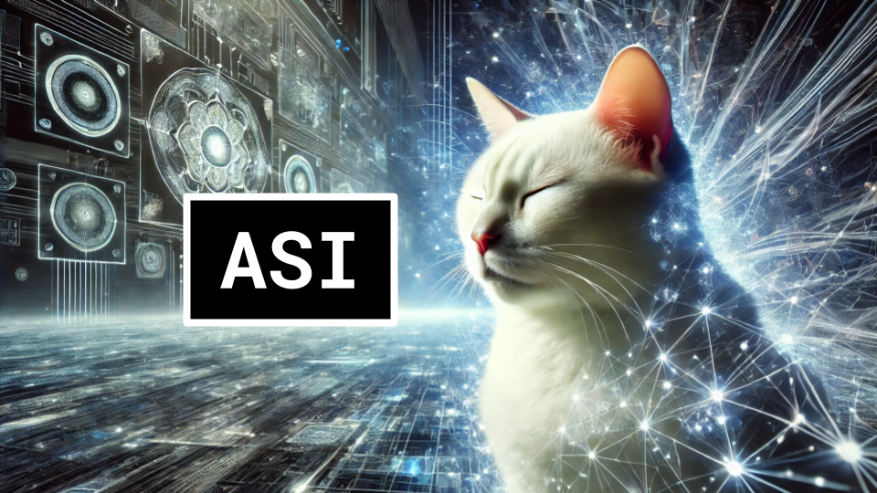

# ASI

### Links

**YouTube:** https://youtube.com/live/KYlbny1rN1g

**X:** https://twitter.com/i/broadcasts/1LyxBgnLEpLKN

**Slides:** https://docs.google.com/presentation/d/16ow5I9n1wEvI8GK223LPCSPgfya83DDMPKmn1TopYjM

### References

https://cs.uwaterloo.ca/~ppoupart/teaching/cs885-spring18/slides/cs885-lecture14a.pdf

https://www.nature.com/articles/nature24270

Towards System 2 Reasoning in LLMs: Learning How to Think With Meta Chain-of-Thought
https://arxiv.org/pdf/2501.04682

Scaling Synthetic Data Creation with 1,000,000,000 Personas
https://arxiv.org/pdf/2406.20094

https://www.youtube.com/watch?v=n0zd5hcOSQI

https://arxiv.org/pdf/2306.11644

https://arxiv.org/abs/2501.07301

https://github.com/exo-explore/llama98.c

https://arxiv.org/pdf/2501.00663

https://arxiv.org/pdf/2501.07542

https://arxiv.org/pdf/2407.13623