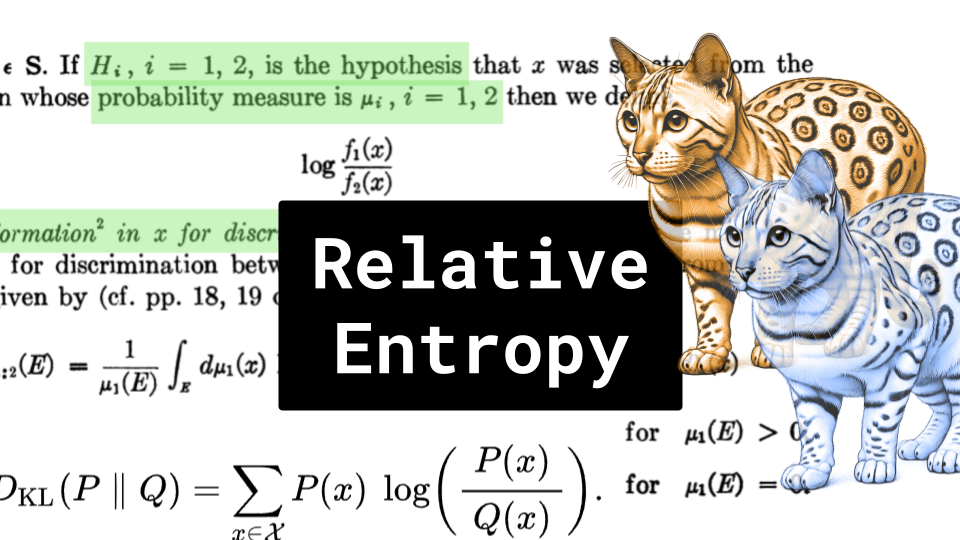

# Relative Entropy

### Links

**YouTube:** https://youtube.com/live/LuF4NGezcxo

**X:** https://twitter.com/i/broadcasts/1YqKDkkpelVxV

**Slides:** https://docs.google.com/presentation/d/1rv8nxR_fXIOFQbaBjHRFD457zqpWZTJ09HsBiT31drA/edit?usp=sharing

### References

https://jax.readthedocs.io/en/latest/_autosummary/jax.scipy.special.kl_div.html

https://pytorch.org/docs/stable/generated/torch.nn.KLDivLoss.html

https://pytorch.org/docs/stable/generated/torch.nn.functional.kl_div.html

https://news.ycombinator.com/item?id=37214898

https://machinelearningmastery.com/divergence-between-probability-distributions/

https://docs.scipy.org/doc/scipy/reference/generated/scipy.special.kl_div.html

https://github.com/huggingface/trl/blob/main/trl/trainer/grpo_config.py

http://joschu.net/blog/kl-approx.html

https://en.wikipedia.org/wiki/F-divergence

https://github.com/MoonshotAI/Kimi-k1.5/blob/main/Kimi_k1.5.pdf

https://github.com/deepseek-ai/DeepSeek-R1/blob/main/DeepSeek_R1.pdf

https://projecteuclid.org/journalArticle/Download?urlId=10.1214%2Faoms%2F1177729694

https://www.tensorflow.org/api_docs/python/tf/keras/metrics/KLDivergence

https://gregorygundersen.com/blog/2020/02/09/log-sum-exp/