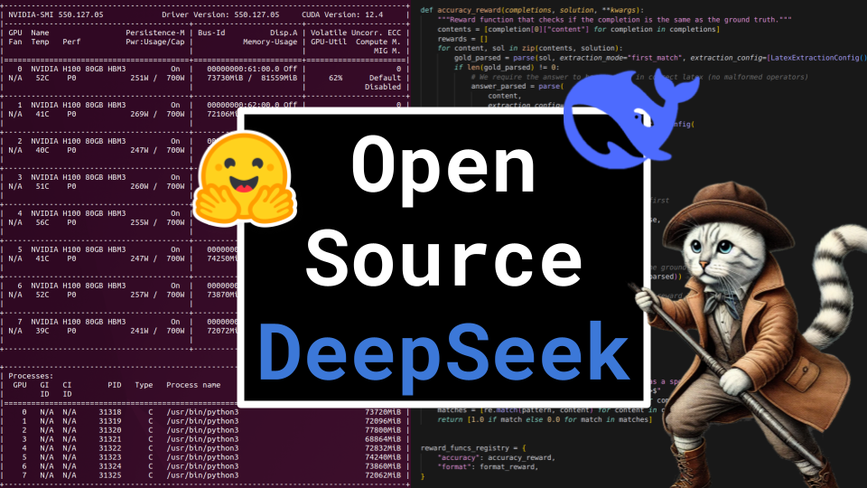

# Open Source DeepSeek

### Links

**YouTube:** https://youtube.com/live/Ii_7-wsTjLo

**X:** https://twitter.com/i/broadcasts/1YqKDkNMrPkxV

**Slides:** https://docs.google.com/presentation/d/1eX8HNGycDcRDO6lRcsj_2PMTzlp5rSQhYkmr3vzh6SI/edit?usp=sharing

### References

https://github.com/huggingface/open-r1

https://github.com/huggingface/trl.git

https://github.com/deepseek-ai/DeepSeek-V3

https://huggingface.co/deepseek-ai/DeepSeek-R1

https://github.com/deepseek-ai/DeepSeek-R1/blob/main/DeepSeek_R1.pdf

https://github.com/deepseek-ai/DeepSeek-V3/blob/main/DeepSeek_V3.pdf

https://arxiv.org/pdf/2402.03300

https://arxiv.org/pdf/2404.05728v3

https://arxiv.org/pdf/2001.08361

https://arxiv.org/pdf/2203.03466