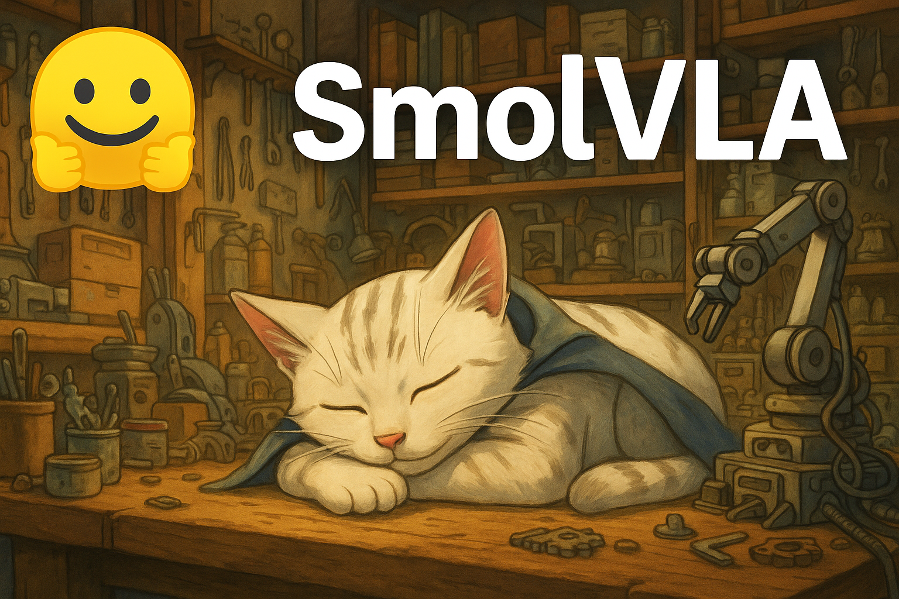

# SmolVLA

### Links

**YouTube:** https://youtube.com/live/VbhL8_vVtVM

**X:** https://x.com/i/broadcasts/1lPJqMklwjLJb

### References

https://arxiv.org/pdf/2506.01844

https://huggingface.co/blog/smolvla

https://huggingface.co/lerobot/smolvla_base

https://huggingface.co/spaces/Beegbrain/FilterLeRobotData

https://huggingface.co/spaces/lerobot/visualize_dataset?path=%2Flerobot%2Fsvla_so100_sorting%2Fepisode_1

https://arxiv.org/pdf/2303.04137

https://www.physicalintelligence.company/download/pi0.pdf

https://github.com/TheRobotStudio/SO-ARM100

https://arxiv.org/pdf/2503.14734


```bash
git clone --depth 1 https://github.com/huggingface/lerobot.git
cd lerobot
uv venv # https://docs.astral.sh/uv/getting-started/installation/
source .venv/bin/activate
uv pip install -e ".[smolvla]"
wandb login
uv run python lerobot/scripts/train.py \
  --policy.path=lerobot/smolvla_base \
  --dataset.repo_id=lerobot/svla_so100_stacking \
  --batch_size=64 \
  --wandb.enable=true \
  --steps=200000
```