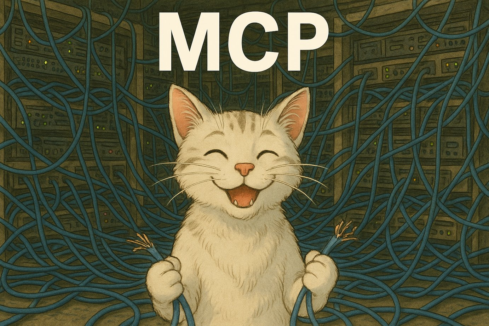

# MCP

### Links

**YouTube:** https://youtube.com/live/k2b4iki0YrE

**X:** https://x.com/i/broadcasts/1dRKZYLjBPQxB

### References

https://github.com/modelcontextprotocol/python-sdk

https://github.com/modelcontextprotocol/inspector

https://youtu.be/eeOANluSqAE

https://youtube.com/shorts/7CHr0qwTcJw

Ideas:
- gradio frontend for tatbot MCP
- git pull on all machines
- uv env install on all machines
- distribute files to all machines
- ojo: start/stop containers, get CPU/GPU usage, pull latest pattern
- rpi1: pause/play live viz, set path and pose w/ live viz, reset live viz, open chrome
- trossen: reset/check realsenses, configure robot, run bot with CLI kwargs