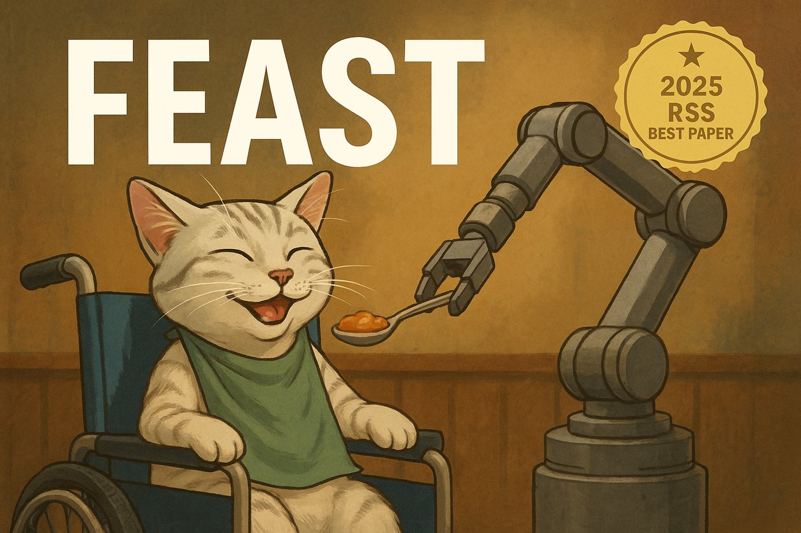

# FEAST (Best Papers at RSS 2025)

### Links

**YouTube:** https://youtube.com/live/y3-BnKNHmIU

**X:** https://x.com/i/broadcasts/1LyxBWNbOAzKN

### References

https://roboticsconference.org/program/awards/

Demonstrating MuJoCo Playground
https://www.roboticsproceedings.org/rss21/p020.pdf

Building Rome with Convex Optimization
https://www.roboticsproceedings.org/rss21/p032.pdf

https://github.com/ComputationalRobotics/XM-code

Solving Multi-Agent Safe Optimal Control with Distributed Epigraph Form MARL
https://www.roboticsproceedings.org/rss21/p027.pdf

FEAST: A Flexible Mealtime-Assistance System Towards In-the-Wild Personalization
https://www.roboticsproceedings.org/rss21/p083.pdf
