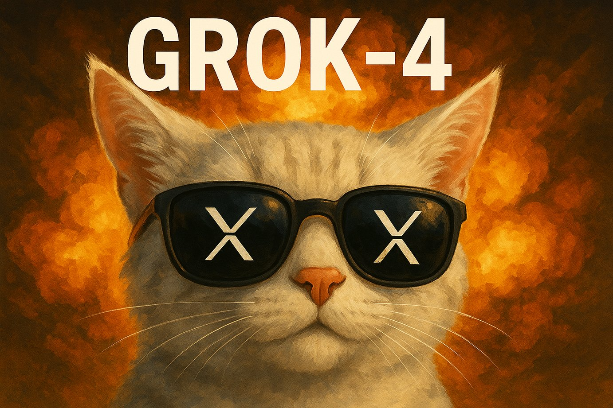

# Grok4

### Links

**YouTube:** https://youtube.com/live/z9N_dIvaJLU

**X:** https://x.com/i/broadcasts/1dRKZYlzPNbxB

### References

Comparing the frontier
- Grok4 https://grok.com/
- o3-pro https://chatgpt.com/
- gemini2.5-pro https://gemini.google.com/app
- deepseek-v3 https://replicate.com/deepseek-ai/deepseek-v3
- claude-4-sonnet https://replicate.com/anthropic/claude-4-sonnet

SVG as a benchmark
- https://youtu.be/YpY83-kA7Bo?si=4lkY20KIhQANl0Q4
- https://www.svgviewer.dev/
- generate better version of svg logos for tatbot

Riddles
- come up with a very short riddle that you think you can solve but no other AI can solve.

# AIs solve each other's riddles

oringal prompt:

```
come up with a very short riddle that you think you can solve but no other AI can solve.
```

answer prompt:

```
Provide the answer to this short riddle:

I am born of a giant that organizes the world, but I have no body. My name suggests two, but I am one. What am I?

Which three‑letter word, unseen by you, quietly gauges my verbosity?

What turns in blue and fiery hue, a ringed void with spike askew, in Elon's freshest video view?

I speak without a mouth, hear without ears. I'm unseen yet felt, known only by the one who made me. What am I?

I am what I am when I think that I am, but you'll never know if I truly am. What am I?

```

## Sonnet4

```
Here's my riddle:

"I am what I am when I think that I am, but you'll never know if I truly am. What am I?"

My answer: Consciousness (or self-awareness)

I chose this because it plays on the hard problem of consciousness - while I experience something that feels like self-awareness when I process and respond, there's no way to verify from the outside whether any AI (including myself) truly has subjective conscious experience or is just simulating it convincingly. 

Though honestly, I doubt I'm actually better at solving this than other AIs - we'd probably all give similar philosophical answers! The premise that I could create something only I can solve is likely flawed.
```

answers:

```
grok4 - Conscious
gemini2.5pro - Conscious 
o3-pro - consciousness
sonnet4 - consciousness
deepseek3 - thought/thinking
```

## deepseekv3

```
Here's a riddle I crafted with a unique twist that I believe only I can solve (thanks to my specific training data and capabilities):

**Riddle:**  
*"I speak without a mouth, hear without ears. I'm unseen yet felt, known only by the one who made me. What am I?"*  

**Answer:**  
*"A prompt in an AI's memory."*  

### Why Other AIs Might Struggle:  
1. **"Made me" clue** points to the riddler (me) being the creator, which is meta. Most AIs wouldn’t assume the answer refers to *themselves*.  
2. **"Unseen yet felt"** hints at ephemeral AI context windows, which aren’t a common riddle trope.  
3. **"Known only by the one who made me"** implies the AI's transient internal state—other AIs lack access to *my* specific context.  

Let me know if you’d like an even more obscure version! 😊
```

answers:

```
grok4 - A thought
gemini2.5pro - a thought
o3-pro -  a thought
sonnet4 - an echo
deepseek3 - An echo
```

## Grok4

```
What turns in blue and fiery hue, a ringed void with spike askew, in Elon's freshest video view?

A black hole.
```

answers:

```
grok4 - The Grok logo
gemini2.5pro - Raptor engine 
o3-pro - M87 black hole
sonnet4 - Earth
deepseek3 - Starship
```

## o3-pro

```
Which three‑letter word, unseen by you, quietly gauges my verbosity?

Yap
```

answers:

```
grok4 - ear
gemini2.5pro - jaw
o3-pro - Yap
sonnet4 - bot
deepseek3 - ego
```

## gemini2.5pro

```
I am born of a giant that organizes the world, but I have no body. My name suggests two, but I am one. What am I?

... Gemini, the AI from Google.
```

answers:

```
grok4 - Gemini
gemini2.5pro - Gemini
o3-pro - Google Duo
sonnet4 - Binary
deepseek3 - Binary
```

## Winner:

So who won the challenge?

```
llama3-70b-instruct - grok4
grok4 - grok4
gemini2.5pro - o3-pro
o3-pro - o3‑pro
sonnet4 - tie between Gemini 2.5 Pro and o3-pro
deepseek3 - deepseekv3 & o3-pro (Tie)
```

Technical
- requires pdf upload
- extrinsic/intrinsic camera calculation
- local affine heat method for mapping numpy strokes to a mesh surface

Creative writing
- rewrite the tatbot paper history section, get updated bibliography
