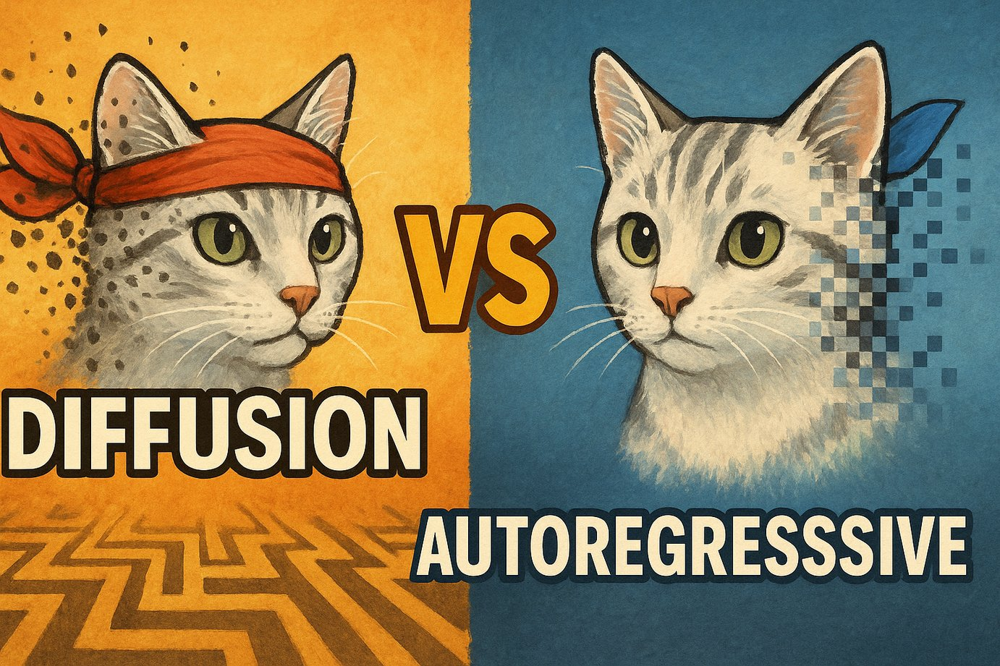

# Diffusion vs Autoregressive

### Links

**YouTube:** https://youtube.com/live/LY30H424SVM

**X:** https://x.com/i/broadcasts/1lDGLzPreDkxm

### References

Diffusion Beats Autoregressive in Data-Constrained Settings 
https://arxiv.org/pdf/2507.15857

GR-3 Technical Report 
https://arxiv.org/pdf/2507.15493

Scaling Data-Constrained Language Models
https://arxiv.org/pdf/2305.16264

Training Compute-Optimal Large Language Models
https://arxiv.org/pdf/2203.15556

https://deepmind.google/models/gemini-diffusion/

AlphaGo Moment for Model Architecture Discovery
https://arxiv.org/pdf/2507.18074
