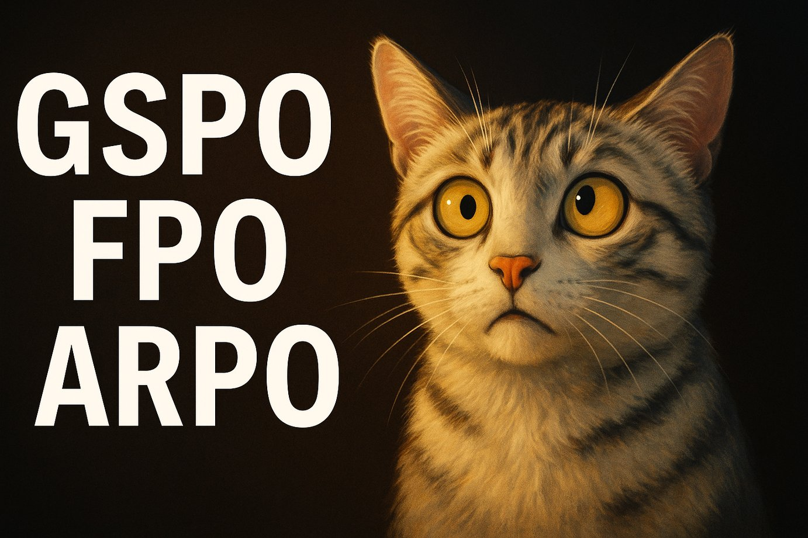

# GSPO, FPO, ARPO

### Links

**YouTube:** https://youtube.com/live/3rNRfVD30Mk

**X:** https://x.com/i/broadcasts/1ypKdZppBzNJW

### References

Group Sequence Policy Optimization
- https://arxiv.org/pdf/2507.18071

Flow Matching Policy Gradients
- https://arxiv.org/pdf/2507.21053

Agentic Reinforced Policy Optimization
- https://arxiv.org/pdf/2507.19849

Spicy AI takes
- https://grok.com/share/bGVnYWN5_c048fc33-aca0-4c59-8152-b1c46ee0df54
- https://chatgpt.com/s/t_688a7f2cd5508191b0f6ccb8d13f0db6
- https://g.co/gemini/share/d93fbf2a6463

TRL implementation
- https://github.com/huggingface/trl/releases/tag/v0.20.0
- https://huggingface.co/papers/2507.18071#6884b011785e717baffee972
