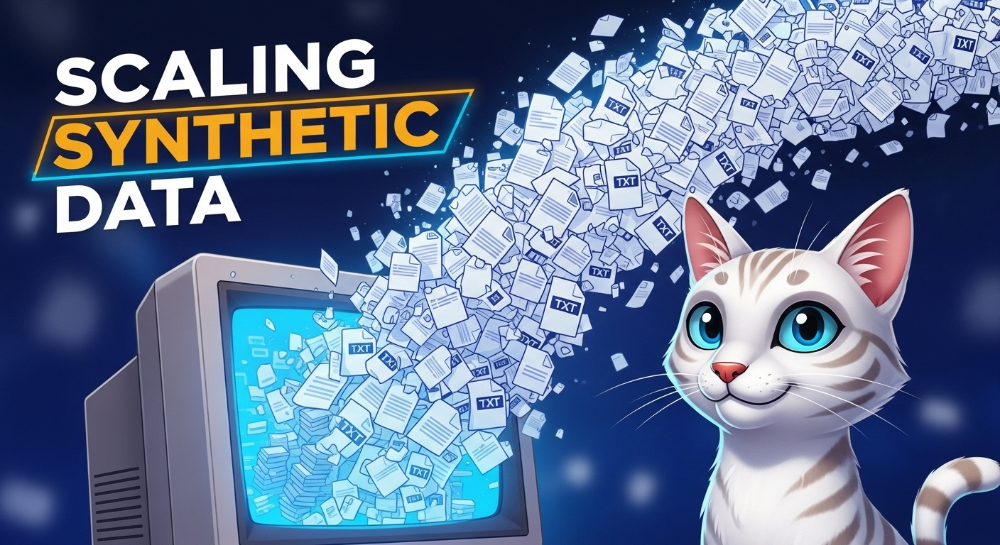

# Scaling Synthetic Data

### Links

**YouTube:** https://youtube.com/live/DDuX2nTWL2g

**X:** https://x.com/i/broadcasts/1eaJbjdQNXQJX

### References

Lessons from Scaling Synthetic Data for Trillion-scale Pretraining
https://arxiv.org/pdf/2508.10975

NVIDIA Nemotron Nano 2: An Accurate and Efficient Hybrid Mamba-Transformer Reasoning Model 
https://arxiv.org/pdf/2508.14444

Thyme: Think Beyond Images 
https://arxiv.org/pdf/2508.11630

DuPO: Enabling Reliable LLM Self-Verification via Dual Preference Optimization
https://arxiv.org/pdf/2508.14460

Embodied-R1: Reinforced Embodied Reasoning for General Robotic Manipulation
https://arxiv.org/pdf/2508.13998