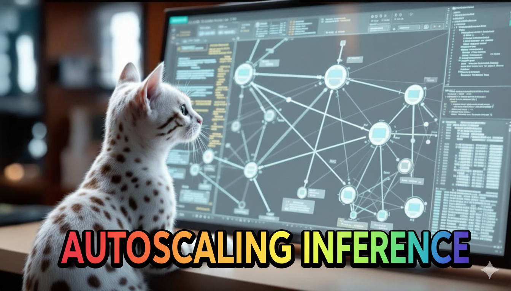

# Autoscaling Inference

### Links

**YouTube:** https://youtube.com/live/N68BDLoVofw

**X:** https://x.com/i/broadcasts/1OwGWelepYqxQ

### References

Taming the Chaos: Coordinated Autoscaling for Heterogeneous and Disaggregated LLM Inference
- https://arxiv.org/pdf/2508.19559

HexGen2: Disaggregated Generative Inference of LLMs in Heterogeneous Environment
- https://arxiv.org/pdf/2502.07903

Hierarchical Autoscaling for Large Language Model Serving with Chiron
- https://arxiv.org/pdf/2501.08090

Taming the Titans: A Survey of Efficient LLM Inference Serving
- https://arxiv.org/pdf/2504.19720v1

ThunderServe: High-Performance and Cost-Efficient LLM Serving in Cloud Environments
- https://arxiv.org/pdf/2502.09334z

- https://replicate.com/playground
- https://huggingface.co/blog/not-lain/kv-caching
- https://upload.wikimedia.org/wikipedia/commons/3/33/PID_Compensation_Animated.gif
- https://miro.medium.com/v2/resize:fit:1400/1*dUO_NoEM0Dsa8nVlsLcMWg.png
- https://www.chinatalk.media/p/ban-the-h20-competing-in-the-inference
- https://bbycroft.net/llm