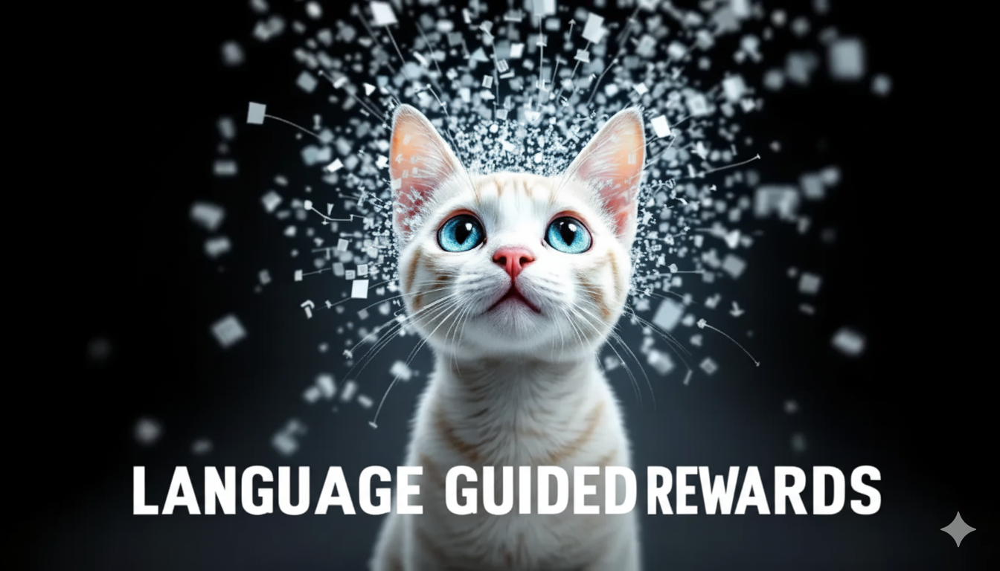

# Language Guided Rewards

### Links

**YouTube:** https://youtube.com/live/sxlpBEFGLxo

**X:** https://x.com/i/broadcasts/1dRKZaoeBLaxB

### References

ReWiND: Language-Guided Rewards Teach Robot Policies without New Demonstrations
- https://arxiv.org/abs/2505.10911
- https://youtu.be/fpOCPQB2spM

Time-Contrastive  Networks:  Self-Supervised  Learning  from  Video
- https://arxiv.org/pdf/1704.06888

TRandAugment: temporal random augmentation strategy for surgical activity recognition from videos
- https://pmc.ncbi.nlm.nih.gov/articles/PMC10491694/
