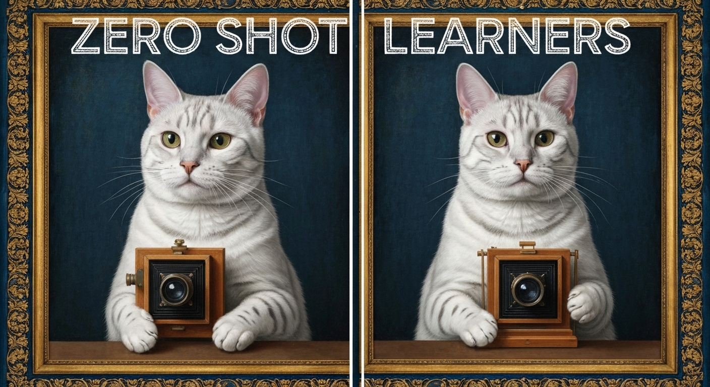

# Zero-Shot Learners

### Links

**YouTube:** https://youtube.com/live/xarxN20_I18

**X:** https://x.com/i/broadcasts/1MYxNlQaqOpGw

### References

Video models are zero-shot learners and reasoners
- https://arxiv.org/pdf/2509.20328

OmniInsert: Mask-Free Video Insertion of Any Reference via Diffusion Transformer Models
- https://arxiv.org/pdf/2509.17627

Qwen3-Omni Technical Report
- https://arxiv.org/pdf/2509.17765

Lynx: Towards High-Fidelity Personalized Video Generation
- https://arxiv.org/pdf/2509.15496

CWM: An Open-Weights LLM for Research on Code Generation with World Models
- https://ai.meta.com/research/publications/cwm-an-open-weights-llm-for-research-on-code-generation-with-world-models/

Gödel Test: Can Large Language Models Solve Easy Conjectures?
- https://arxiv.org/pdf/2509.18383